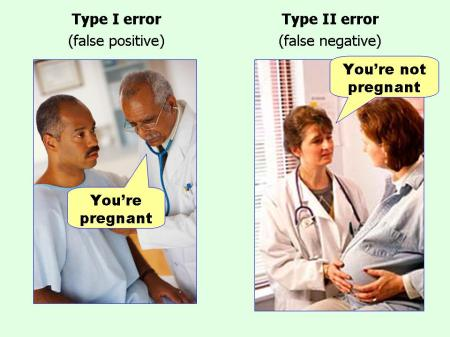

```{r, echo=FALSE, warning=FALSE}
knitr::opts_chunk$set(comment="#", fig.retina=2, crayon.enabled = TRUE, dpi=600)
set.seed(15)
library(knitr)
library(ggplot2)
library(kableExtra)
library(formattable)
library(dplyr,warn.conflicts = FALSE)
library(latex2exp)
```

## Learning Goals

- Choose appropriate null and alternative hypotheses.

- Determine whether the test should be one-sided or two-sided.

- Calculate $Z$-test statistics and $t$-test statistics.

- Calculate the $P$-value.

- Determine whether to reject or fail reject the alternative hypotheses.

- Interpret the results of a test of significance in context.

---

## The Basic Idea of Hypothesis Testing

- The testing procedure starts with an initial assumption that the statement on population parameter is true.

- We test this initial assumption using a random sample. If the initial assumption is really the truth, then the test statistic from a random sample shouldn't be too far away from the center of the sampling distribution. Conversely, if it is <span class="green">too far away</span>, then we should <span class="green">not believe in</span> the initial assumption.

- To determine how far is too far away, we need to specify a threshold, a prior probability, or equivalently a critical value.

- If the test statistic is at least extreme as the critical value, then the test is significant enough to allow us to reject the initial assumption. Otherwise, we cannot draw a definite conclusion.

- The prior probability measures the chance the initial assumption was wrongly rejected.

---

## Two Hypotheses

- A statistical **hypothesis** is a statement about a population parameter.

- A **hypothesis test** is a process that uses sample statistics to test a **hypothesis**.

- To test a population parameter, we choose a pair of hypotheses, the null hypothesis and the alternative hypothesis which are contradictory to each other.

- The **null hypothesis**, denoted by $H_0$, is the statement about the population parameter that is assumed to be true.

- The **alternative hypothesis**, denoted $H_a$, is a statement about the population parameter that is contradictory to the null hypothesis.

---

## Example: Identify Null and Alternative Hypotheses

1. Test a statement that the population mean is 1.
2. Test a statement that the population mean is more than 3.
3. Test a statement that the population mean is no more than 3.

**Solution:** Keep in mind that the null hypothesis should always contains the equal sign. The alternative hypothesis is contrary to the null hypothesis.

1. We may set the null hypothesis as $H_0$: $μ = 1$. Depending on the given information, otherwise, we may set the alternative hypothesis as $H_a$: $μ\ne 1$.
2. We may set the null hypothesis as $H_0$: $μ = 3$ and the alternative hypothesis as $H_a$: $μ>3$.
3. We may set the null hypothesis as $H_0$: $μ \le 3$ and the alternative hypothesis as $H_a$: $μ>3$.

---

## The Logic of Hypothesis Testing

The logic of hypothesis testing and two types of error can be summarized in the following table.

```{r HypoTest, echo=F}
row1 <- c("", "\\(H_0\\) is true", "\\(H_0\\) is false")
row2 <- c("Reject \\(H_0\\)", "<span class=\"red\">Type I Error</span>", "<span class=\"green\">Correct decision</span>")
row3 <- c("Fail to Reject \\(H_0\\)", "<span class=\"green\">Correct decision</span>", "<span class=\"red\">Type II Error</span>")

tb <- rbind(row2, row3)

tb <- as.data.frame(tb)
row.names(tb)<-NULL
colnames(tb) <- row1

kable(tb, format = "html", escape=F, align = "c")%>%
#    add_header_above(c("", "Truth of \\(H_0\\)" = 2))%>%
    kable_styling(full_width = F, protect_latex=T)
```

The interpretation of hypothesis testing is summarized in the following table.

```{r HypoTestDec, echo=F}
rowa <- c("", "If the claim to be tested is in \\(H_0\\)", "If the claim to be tested is in \\(H_a\\)")
rowb <- c("Reject \\(H_0\\)", "<span class=\"green\">There is enough evidence to reject the claim</span>", "<span class=\"green\">There is enough evidence to support the claim</span>")
rowc <- c("Fail to Reject \\(H_0\\)", "<span class=\"blue\">There is not enough evidence to reject the claim</span>", "<span class=\"blue\">There is not enough evidence to support the claim</span>")

tbd <- rbind(rowb, rowc)

tbd <- as.data.frame(tbd)
row.names(tbd)<-NULL
colnames(tbd) <- rowa

kable(tbd, format = "html", escape=F)%>%
#    add_header_above(c("", "Interpretation" = 2))%>%
    kable_styling(full_width = F, protect_latex=T)
```

---

## Type of Errors in Hypothesis Testing

- Rejecting the null hypothesis when it is indeed true is called a **type I error**. The maximum allowable probability of making a type I error is the **level of significance**, denoted by $\alpha$.

- Failing to reject the null hypothesis when the it is false is called a **type II error**. The probability of a type II error is usually denoted by $\beta$. The **power of a hypothesis test**, equals $1-\beta$, is the probability of rejecting the null hypothesis when it is false.

::: {.center}
  {30%"}
:::

::: {.footmark}
Source: [An illustration of errors](https://effectsizefaq.com/2010/05/31/i-always-get-confused-about-type-i-and-ii-errors-can-you-show-me-something-to-help-me-remember-the-difference/).
See also [the interactive demonstration of errors and the power](https://istats.shinyapps.io/power/).
:::

---

## Type of Tests

- If $H_a$ has the form $\mu\neq \mu_0$ the test is called a **two-tailed test**.

- If $H_a$ has the form $\mu<\mu_0$ the test is called a **left-tailed test**.

- If $H_a$ has the form $\mu>\mu_0$ the test is called a **right-tailed test**.

- Each of the last two forms is also called a **one-tailed test**.

---

## Observed Significance

- To make a decision, one may also compare probabilities. The **observed significance** (**\\( P \\)-value**) of a test statistic is the probability of obtaining a sample statistic at least as extreme as the (observed) test statistic, given that the null hypothesis were true.

- $P$-Value as Tail area

  ::: {.center}
  |Sign in $H_a$ | $\ne$ | $<$ | $>$  |
  |---|---|---|---|
  | $P$-value  | Double of the tail area | Left tail area | Right tail area |
  :::

- Making decision by comparing the $P$-value with the significance level $\alpha$:
  
  - reject $H_0$ if $p≤\alpha$ and

  - do not reject $H_0$ if $p>\alpha$.

---

## Example: Make a Decision Using the $P$-value

Consider the following testing hypotheses

::: {.center}
$H_{0}: p=0.50$ vs. $H_{a}: p\ne 0.50, n=360, \hat{p}=0.56$.
:::

Find the $P$-value for the test and make a decision at the 5% level of significance.

**Solution:** Because $H_a$ is <span class="purple">\(p\ne p_0\)</span> and <span class="grey">\(\hat{p}=0.56>p_0\)</span>, the $P$-value is the <span class="purple">double</span> of the <span class="grey">right tail</span> area, that is, the $P$-value equals $2P(\hat{p}>0.56)$.

We first find the standard error of the null distribution:
$$\text{SE}=\sqrt{p_0(1-p_0)/n}=\sqrt{0.5\cdot0.5/360}=`r round(sqrt(0.5*0.5/360),2)`.$$

The $P$-value is approximately `r round(2*(1-pnorm(0.56,0.5,0.03)), 4)` which can be calculated by the Excel function `2*(1-NORM.DIST(0.56,0.5,0.03,TRUE)`.

Since the $P$-value is smaller than $\alpha$, we reject the null hypothesis $H_0$.

---

## Practice: Conceptual Understanding {.unnumbered}

Decide whether the following statements are true or false. Explain your reasoning.

- In case of a left-tailed test, we reject the null hypothesis if the sample statistic is significantly smaller than the hypothesized population parameter.
- A $P$-value of 0.08 is more evidence against the null hypothesis than a $P$-value of 0.04.
- The statement, "the $P$-value is 0.03", is equivalent to the statement, "there is a 3% probability that the null hypothesis is true".
- Even though you rejected the null hypothesis, it may still be true.
- Failing to reject null hypothesis means the null hypothesis is true.
- That the $P$-value of a sample statistic is $p=0$ means the null hypothesis cannot be true.

::: {.footmark}
Questions are partially taken from [Conceptual questions on hypothesis testing](http://www2.stat.duke.edu/~jerry/sta101/tests.html)
:::

---

## Practice: Determine the Type of Test {.unnumbered}

::: {.iframecontainer}
`r knitr::include_url('https://www.myopenmath.com/embedq2.php?id=168392&seed=2020&showansafter', height='560px')`
:::

---

## Practice: Find the $P$-value {.unnumbered}

Suppose we’re conducting a hypothesis testing for a population mean. Find the $P$-value for each of the following testing scenario with the given sample size $n$ and the test statistics $t$.

- $H_{0}: \mu=25 \text { vs. } H_{a} : \mu<25$, $n=30$, $t=-2.43$.
- $H_{0}: \mu=35 \text { vs. } H_{a} : \mu>35$, $n=50$, $t=2.13$.
- $H_{0}: \mu=-7.9 \text { vs. } H_{a} : \mu\ne-7.9$, $n=40$, $t=-1.99$.

---

## Practice: Make a Decision {.unnumbered}

::: {.iframecontainer}
`r knitr::include_url('https://www.myopenmath.com/embedq2.php?id=462486&seed=2020&showansafter', height='560px')`
:::

---

## Practice: Interpret a Decision {.unnumbered}

::: {.iframecontainer}
`r knitr::include_url('https://www.myopenmath.com/embedq2.php?id=336259&seed=2020&showansafter', height='560px')`
:::

---

<!--# class="center middle" -->

::: {.part}
Lab Instructions in Excel
:::

---

## Normal Distribution for Hypothesis Testing

- Let $Z$ be a standard normal random variable. In Excel, $P(Z<z)$ is given by `NORM.S.DIST(z,TRUE)`.

- Let $X$ be a normal random variable with mean $\mu$ and standard deviation $\sigma$, that is $X\sim \mathcal{N}(\mu, \sigma^2)$. In Excel, $P(X<x)$ is given by `NORM.DIST(x,mean,sd,TRUE)`.

- When a cumulative probability $p=P(X<x)$ of a normal random variable $X$ is given, we can find $x$ using `NORM.INV(p,mean,sd)`.

- When a cumulative probability $p=P(Z<z)$ of a standard normal random variable $Z$ is given, we can find $z$ using `NORM.S.INV(p)`.

---

## $t$-Distribution for Hypothesis Testing

Suppose a Student's $t$-distribution has the degree of freedom $\text{df}=n-1$.

- To find a probability for a given $t$-value

  - The area of the left tail of the $t$-value may be calculated by the function `T.DIST(t,df,true)`.

  - The area of the right tail of the $t$-value may be calculated by the function `T.DIST.RT(t, df)`.

  - The area of two tails of the $t$-value (\\(t>0\\)) may be calculated by function `T.DIST.2T(t,df)`.

- To find the critical value for a given probability $p$

  - When the area of the left tail is given, the function `T.INV(p,df)` may be used.
  
  - When the area of both tails is given, the function `T.INV.2T(p,df)` may be used. This function is good for construction confidence interval.

---

## Lab Practice: Testing Mean with $\sigma$ {.unnumbered}

Suppose the population standard deviation is $\sigma=4.3$. At the significance level $\alpha=0.02$, construct the a standardized rejection region for the following test for the population mean

::: {.center}
Test $H_0: \mu=21.6$ vs. $H_a: \mu<21.6$.
:::

Make a decision if a random sample has the size $n=70$ and mean $\bar{x}=20.5$.
