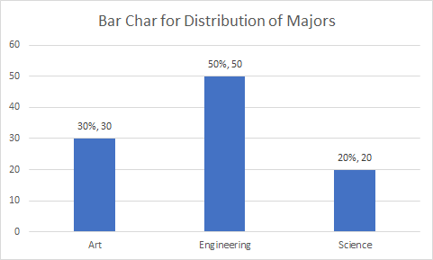
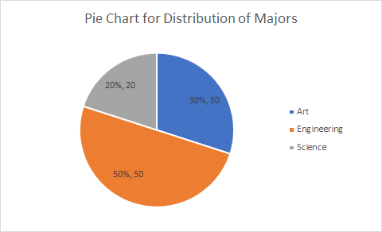

```{r, echo=FALSE, warning=FALSE}
knitr::opts_chunk$set(comment="#", fig.retina=2)
library(stats)
library(kableExtra)
library(knitr)
library(formattable)
library(ggplot2)
library(ggthemes)
library(ggExtra)
library(data.table)
library(dplyr, warn.conflicts = FALSE)
set.seed(3)
load("Data-Frames-SUNY-Concepts-in-Statistics/actor.RData")
```

## Learning Goals {.unnumbered}

- Create and interpret graphs (dot plots, histograms, pie charts, bar charts) as a means of summarizing and communicating data meaningfully.

- Identify the shape of a distribution (right-skewed, left-skewed, symmetric, or uniform).

---

## Distribution of Numerical Data

- In data analysis, one goal is to describe **patterns** (known as the **distribution**) of the variable in the data set and create a useful summary about the set.
- To describe patterns in data, we use descriptions of **shape**, **center**,
and **spread**. We also describe exceptions to the pattern. We call these exceptions **outliers**.
::: {.center}
  {height=60%}
:::
::: {.remark style="margin-top: -1em"}
The center of a distribution may refer to the mean, the weight balancing point; the median, the 50/50 breaking points; or a mode, a peak. For a geometric explanation, see [Mean, Median and Mode in Distributions: Geometric Aspects](https://openpress.usask.ca/introtoappliedstatsforpsych/chapter/3-1-central-tendency-mean-median-mode/)
:::

---

## Dot Plots

A **dot plot** includes all values from the data set, with one dot for each occurrence of an observed value from the set.

**How to Construct**

1. Draw a horizontal line and mark it with an appropriate measurement scale.
2. Locate each value in the data set along the measurement scale, and represent it by a dot. Stack the dots vertically if the value appear multiple times.

---

## Example: Petal Lengths of Iris Flower

The data set contains 15 petal lengths of iris flower. Create a dot plot to describe the distribution of petal lengths.

::: {.center}
```{r echo=FALSE, results = 'asis'} 
cat(paste(head(iris$Petal.Length,15), collapse=", "))
```
:::

**Solution:** For each number in the data set, we draw a dot. We stack dots of the same value from bottom to up.

::: {.center}
```{r echo=FALSE, results = 'asis', fig.width=6, fig.asp=0.5} 
# use the preloaded iris package in R
irisdot <- head(iris["Petal.Length"],15)
# find the max frequency (used `plyr` package)
yheightPL <- max(plyr::count(irisdot, vars = "Petal.Length"))
# basic dotplot (binwidth = the accuracy of the data)
dotchart = ggplot(irisdot, aes(x=Petal.Length), dpi = 600)
dotchart = dotchart + geom_dotplot(binwidth=0.1, method="histodot", dotsize = 0.6, fill="blue")
# dotchart = dotchart + stat_density(aes(y=0.1/7*..count..), geom="line", colour="red", linetype="dashed", size=1,adjust=1.2)
# use coor_fixed(ration=binwidth*dotsize*max frequency) to setup the right y axis height.
dotchart = dotchart + theme_bw() + coord_fixed(ratio=0.1*0.6*yheightPL)
# tweak the theme a little bit
dotchart = dotchart + theme(panel.background=element_blank(),
                            panel.border = element_blank(),
                            panel.grid.minor = element_blank(),
                            # plot.margin=unit(c(-4,0,-4,0), "cm"),
                            axis.line = element_line(colour = "black"),
                            axis.line.y = element_blank(),
)
# add more tick mark on x axis
dotchart = dotchart + scale_x_continuous(breaks = seq(1,1.8,0.1))
# add tick mark on y axis to reflect frequencies. Note yheightPL is max frequency.
dotchart = dotchart + scale_y_continuous(limits=c(0, 1), expand = c(0, 0), breaks = seq(0, 1,1/yheightPL), labels=seq(0,yheightPL))
# remove x y lables and remove vertical grid lines
dotchart = dotchart + labs(x=NULL, y=NULL) + removeGridX()
dotchart
```
:::

---

## Practice: Heights of Cherry Trees {.unnumbered}

The data set contains the heights of 20 Black Cherry Trees. Create a dot plot to describe the distribution of the heights.

::: {.center}
```{r echo=FALSE, results = 'asis'} 
cat(paste(sort(sample(trees$Height,20)), collapse=", "))
```
:::

---

## Histograms (1 of 2)

- Histograms are frequently used to describe large sets of numerical data, in particular, data of a continuous variable.

- A **histogram** consists of a horizontal axis, a vertical axis and adjoining vertical bars. The horizontal axis is labeled to break data values into **bins (classes)**. The vertical axis is then scaled accordingly so that the area of a bar is the frequency or the relative frequency of values in the bin.

- To construct a histogram, we need to decide boundary of bars which forms intervals, called **bins or classes** and find the **frequency** of values in each bin.

- A **frequency distribution** is a table which contains bins, frequencies and **relative frequencies** which are proportions (percentage) defined by the formula $\text{Relative frequency} =\dfrac{\text{Class frequency}}{\text{Sample size}}$.

---

## Histograms (2 of 2)

- The lower boundary of a bin is called a **lower bin limit**. The upper boundary of a bin is called an **upper bin limit**.
  
- The **bin width** is the distance between the lower (or upper) bin limits of two consecutive bins.

- The difference between the maximum and the minimum data entries is called the **range**.

- The range is roughly, indeed slightly smaller than, $\text{number of bins}\times \text{bin width}$.
  
- The **midpoint** of a bin is the half of the sum of the lower and upper limits of the bin.

- Bin limits should be chosen so that each value of the data is in exactly one bin.

---

## Conventions on Constructing Bins

- For a continuous variable: take an appropriate bin width, take the first lower bin as the minimum, and then take left closed and right opened intervals as bins.
- For a discrete variable: take an appropriate bin width and take the first lower bin limit to be a value slightly smaller than the minimum minus of the data set.
- Excel convention (roughly): take left opened and right closed intervals.

::: {.remark}

1. Histograms are usually used for continuous data. For discrete numerical variables, the using of a bar chart or a histogram depends on context.
2. The choice of bin width (or the number of bins) has a more significant impact on the histogram than the method used to determine bin limits.
3. It's often helpful to visualize the data using different binning strategies.
<!-- 4. There are also different conventions to determine the number of bins or bin width. -->

:::

---

## Example: Histogram of mpg (1 of 3)

The following data set show the mpg (mile per gallon) of $`r SampleSize<-30; SampleSize`$ cars.  Construct a frequency table and frequency histogram for the data set using $`r Nbins<-ceiling(2*SampleSize^(1/3)); Nbins`$ bins. What can be concluded from the histogram?

::: {.center}

```{r echo=FALSE, results = 'asis'}
cars <- head(mtcars$mpg,SampleSize)
cat(paste(cars, collapse=", "))
```

:::

**Solution:**

- Find the range using $\text{Range}=\text{maximum}-\text{minimum}$. Here, the minimum is $`r sm<-min(cars); sm`$, the maximum is $`r lg<-max(cars); lg`$, and the range is $`r lg`-`r sm`=`r rg<-lg-sm; rg`$.
- For $k$ bins, the bin width can be taken between $\frac{\mathrm{range}}{k}$ and $\frac{\mathrm{range}}{k-1}$. Here, we take the bin width as $`r Bwidth<-ceiling(10*rg/Nbins)/10; Bwidth`$ which is between $\frac{`r rg`}{`r Nbins`}\approx `r round(rg/Nbins, 3)`$ and $\frac{`r rg`}{`r Nbins`-1}\approx `r round(rg/(Nbins-1), 3)`$.
- Take the first lower bin limit as the minimum $`r sm`$. Add the bin width $`r Bwidth`$ recursively to get all lower bin limits: `r lowerbins<- sm+Bwidth*c(0:(Nbins-1)); lowerbins`.

---

## Example: Histogram of mpg (2 of 3)
<!-- 
**Solution:**(continued) -->
- The upper limits can be taken as `r upperbins<-lowerbins+Bwidth; upperbins`.
::::: {.row style="margin:-0.5em;"}
::: {.pull-left}

- Construct a frequency distribution table

```{r echo=FALSE}
br = seq(from=sm, to=sm+Nbins*Bwidth, by=Bwidth)
bins = paste("[", head(br,-1), "," , br[-1], ")")
freq   = hist(cars, breaks=br, right=FALSE, include.lowest=TRUE, plot=FALSE)
freq.table <- data.frame(range = bins, frequency = freq$counts)
names(freq.table) <-c("Bin","Frequency")
kable(freq.table, align="cc")
```
:::

:::: {.pull-right}

- Graph the histogram using the frequency distribution table.

::: {.center}
```{r echo=FALSE, results = 'asis', fig.width=9, fig.asp=0.5} 
carshist <- head(mtcars["mpg"],30)
ggplot(carshist, aes(x=mpg), dpi=600) +
  geom_histogram(binwidth=Bwidth,boundary=sm,
                 fill="lightblue", col="white",linewidth=1) +
  stat_density(aes(y=4*..count..), geom="line",
               colour="blue", linetype="dotdash", linewidth=1, adjust=1.2) +
  geom_vline(aes(xintercept=mean(mpg)),
          color="brown", linetype="dashed", linewidth=1) +
  geom_vline(aes(xintercept=median(mpg)),
          color="red", linetype="dotted", linewidth=1) +
  scale_x_continuous(breaks = (head(br,-1)+br[-1])/2, labels=bins) +
  scale_y_continuous(breaks = seq(0, 9, 1)) +
  ggtitle("Histogram of Mile Per Gallon of 30 Cars") +
  xlab("Mile Per Gallon")+
  ylab("Frequency") +
  theme_bw(base_size = 16) +
  theme(panel.grid.minor = element_blank(),
    axis.text = element_text(face="bold", size=12),
    plot.title = element_text(face="bold", size=18, hjust=0.5),
    axis.title = element_text(face="bold", size=12)
  )
```
:::

::: {style="margin-top: 1em; font-size: 75%;"}
The blue dot-dash curve is called the density curve, the brown dashed line is over the mean, the red dotted line is over the median.
:::

::::
:::::

---

## Example: Histogram of mpg (3 of 3)

The following information can be obtained from the histogram.

- The histogram has a single peak within the interval 13.8 and 20.6.

- Majority of cars in the sample has mpg lower than 20.6.

- The mean mpg is around 20.6.

- The range of the mpg is between 13.8 and 34.2.

- The right tail is longer.

---

## Some Remarks on Histogram (1 of 2)

- There should be *no space* between any two bars.

- The area of a bar represents the relative frequency for the bin. Equivalently,
  $$\text{area of bar} = \text{relative frequency} = \text{height of bar (density)}\times \text{bar width}.$$

- The vertical axis is called the density scale.

- For continuous variables, unequal bin width may also be used.

---

## Some Remarks on Histogram (2 of 2)

- One convention about the bin width for $k$ bins is to choose a number with the same or one more decimal place that is greater than $\frac{\text{range}}{k}$, but no more than $\frac{\text{range}}{k-1}$ as the bin width.

- To determine the number of bins, there are practical rules. For example, the Rice rule takes the bin number $k$ as the **round up of $n^{1 / 3}$**. The webpage [Statistic How To](https://www.statisticshowto.com/choose-bin-sizes-statistics/) has more information.

- The convenient starting point can be a value smaller but not too much smaller than the minimum.

- The bin width can significantly affect the shape of the histogram. It is better to experiment with different choices.

---

## Practice: Petal Lengths of Irises {.unnumbered}

The following data set show the petal length of 20 irises. Construct a frequency table and frequency histogram for the data set using `r ceiling(2*20^(1/3))` bins. What can you conclude from the histogram?

::: {.center}
```{r echo=FALSE, results = 'asis'} 
irispetal <- sample(iris$Petal.Length,20)
cat(paste(irispetal, collapse=", "))
```
:::

---

## Stem-and-Leaf Plots

A stem-and-leaf plot is a kind of histogram that lets you see all your data instead of just class frequency information. The leading digit(s) form stems and the "tailing digits" form leaves.

**How to Construct**

- Select one or more leading digits for the stem values. The trailing digits become the leaves. **Trailing digits for the same stem may further break into two leaves, lower or higher.**
- List possible stem values in a vertical column.
- Record the leaf for every observation beside the corresponding stem value.
- Indicate the units for stems and leaves someplace in the display.

---

## Example: Heights of Cherry Trees

Consider the following data of heights of 15 cherry trees. Create a stem-and-leaf plot and describe the distribution.

::: {.center}
```{r echo=FALSE, results = 'asis'}
cherrytrees <- sample(trees$Height,15)
cat(paste(sort(cherrytrees), collapse=", "))
```
:::

**Solution:**

:::: {style="display: flex; align-items: center; justify-content: center;"}

```{r stem1, echo=FALSE, comment=NA}
out1 <- capture.output(stem(cherrytrees, scale = 0.5))
stemout1 <- paste(out1[nzchar(out1)], collapse="\n")
cat(stemout1, sep="\n")
```

::::

---

## Common Descriptions of Shape Distribution

- **Right skewed** (or reverse $J$-shaped): A right-skewed distribution has a lot of data at lower variable values.

- **Left skewed** (or $J$-shaped): A left skewed distribution has a lot of data at higher variable values with smaller amounts of data at lower variable values.

- **Symmetric with a central peak (or bell-shaped)**: A central peak with a tail in both directions. A bell-shaped distribution has a lot of data in the center with smaller amounts of data tapering off in each direction.

- **Uniform**: A rectangular shape, the same amount of data for each variable value.

- For examples of left skewed and uniform distributions, please see the example in [Dotplot 2 of 2 in Concepts in Statistics](https://courses.lumenlearning.com/wmopen-concepts-statistics/chapter/dotplots-2-of-2/)

---

## Practice: Shapes of Distributions {.unnumbered}

Statistics are used to compare and sometimes identify authors. The following lists shows a simple random sample that compares the letter counts for three authors.

Terry: 7, 9, 3, 3, 3, 4, 1, 3, 2, 2

Davis: 3, 4, 4, 4, 1, 4, 5, 2, 3, 1

Maris: 2, 3, 4, 4, 4, 6, 6, 6, 8, 3

Create a dot plot for each sample and describe the shape of the distribution of each sample.

::: {.footmark}
Source: [Example 2.7.1, OpenStax Introductory Statistics](https://stats.libretexts.org/Bookshelves/Introductory_Statistics)
:::

---

## Centers of a Data Set

- **Mean**: The mean is the average, this is the quotient of the total sum by the total number.
- **Median**: The median is a value that separates the data set into the lower half set and the upper half set.
- **Mode**: The mode is the data value that has the most occurrence in the data set.

::: {.remark}

- When the distribution is **approximately symmetric** with a single central peak, the *mean* is usually used to measure the center. The *median* is used as a measure of center for all *other cases*.
- Before analyzing the center, it's better to graph the data and determine the shape of the distribution.

:::

---

## Mean and Median for Distributions in Different Shapes

`r knitr::include_url("https://istats.shinyapps.io/MeanvsMedian/", height="550px")`

::: {.footmark}
Source: https://istats.shinyapps.io/MeanvsMedian/
:::

---

## Practice: Appropriate Measure of Center {.unnumbered}

A student survey was conducted at a major university. The following histogram shows distribution of alcoholic beverages consumed in a typical week.
1. What is the typical number of drinks a student has during a week?
2. Do the data suggest that drinking is a problem in this university?
::: {.center}
```{r echo=FALSE, results = 'asis', fig.width=12, fig.asp=0.5} 
load("Data-Frames-SUNY-Concepts-in-Statistics/drinking.rdata")
drinking <- rename(data)
drinkinghabit<- drinking$Alcohol[!is.na(drinking$Alcohol)]
dfdrk <- data.frame(drinkinghabit)
colnames(dfdrk) <- c("Alcohol")
drhist <- ggplot(dfdrk, aes(x=Alcohol), dpi=600) +
  geom_histogram(binwidth=4, boundary=0,fill="lightblue", col="white") + 
  scale_x_continuous(breaks = seq(0, 36, 1)) + 
  scale_y_continuous(breaks = seq(0, 140,5)) +
  theme_bw(base_size = 16) +
geom_vline(aes(xintercept=mean(Alcohol)),       color="blue", linetype="dashed", size=1) +
geom_vline(aes(xintercept=median(Alcohol)), color="red", linetype="dashed", size=1) + 
# geom_vline(aes(xintercept=quantile(Alcohol)[2]), color="black", linetype="dashed", size=1) + 
#geom_vline(aes(xintercept=quantile(Alcohol)[4]), color="yellow", linetype="dashed", size=1) + 
ylab("Frequency")
#ggplot(dfdrk, aes(x="", y=Alcohol), dpi=600)+
#geom_boxplot(fill = "green")
drhist + 
  ggtitle("Histogram of alcoholic beverages consumed per week") +
  theme_bw(base_size = 16) +
  theme(panel.grid.minor = element_blank(),
    axis.text = element_text(face="bold"),
    plot.title = element_text(face="bold", size=18, hjust=0.5),
    axis.title = element_text(face="bold")
  )
```
:::

::: {.footmark}
*The red line is over the median and the blue line is over the mean.*
:::

---

## Frequency Distribution for Categorical Data

- A **frequency distribution for categorical data** is a table that displays the possible categories along with the associated frequencies and/or relative frequencies.

- The **frequency** of a category is the number of occurrences of elements in the category.

- The proportion of a frequency to the size of the population or the sample is also called the **relative frequency**.

- A **relative frequency distribution** is a frequency distribution that includes relative frequencies.

---

## Visualization of Categorical Data

- A **bar chart** consists of bars (rectangles), each represent a category and the area of each bar is constantly proportional to the relative frequency of that category.

- A **pie chart** is a pie with sectors represents categories and the area of each sector is proportional to the relative frequency of that category.

- **Stacked bar char** (segmented bar chart) is a bar divided into segments, with each segment representing a category and the area of the segment is proportional to the relative frequency for that category.

---

## Example: Distribution of Majors (1 of 2)

::::: {.row}
::: {.pull-left}
The counts of majors of 100 students in a sample are shown in the table on the right. Visualize the data using a bar, pie and stacked bar chart.
:::

:::: {.pull-right}
::: {.center}
| Grade | Frequency (Counts) |
| :----- | ------ |
| Art     | 30      |
| Engineering | 50      |
| Science    | 20      |
:::
::::
:::::

**Solution:** The relative frequency table is shown below.  

::: {.center}

| Major       | Frequency| Relative Frequency|
| :----------- | -------------------- | ------------------------------- |
| Art         | 30                   | 30%                             |
| Engineering | 50                   | 50%                             |
| Science     | 20                   | 20%                             |
| Total       | 100                  | 100%                             |
:::

---

## Example: Distribution of Majors (2 of 2)

The following are the charts created in Excel.

:::: {.row}
::: {.center width=32%}
Bar chart
{80%}
:::

::: {.center width=32%}
Pie chart
{width=100%}
:::

::: {.center width=32%}
Stacked bar chart
{width=80%}
:::
::::

---

## Practice: Passengers on Titanic {.unnumbered}

The following data table summarize passengers on Titanic. Using a chart to describe the data table.

```{r echo=FALSE}
titanic <- data.frame(
  Class = c("1st", "2nd", "3rd", "Crew"),
  Passengers = c(325, 285, 706, 885)
)
knitr::kable(titanic, 'pipe', align = "cc")
```

---

<!--# class="middle center"-->

::: {.part}
Lab Instructions in Excel
:::

---

## Frequency Tables

In Excel, to create a frequency table for a data array, we need a bin array. The values in a bin array in Excel are the first $k-1$ upper bin limits. For example, if the bin array consists of 30, 40, and 50, then the bins will be $[\text{min},30]$, $(30,40]$, $(40, 50]$, $(50, \infty)$.

With a data array and a bin array, the Excel function `FREQUENCY(data_array, bins_array)` can be used to create a frequency table.

Suppose the data set is in `column A` and the bin array is in `column B`.

1. In `column C`, select a column array of $k$ cells, then enter `=FEQUENCY(`
2. select the data values
3. in the formula bar, enter the symbol comma `,`
4. select the bin array
5. in the formula bar, enter `)`.

Hit `Enter` (`Ctrl + Shift + Enter` in older versions), you will get a frequency table.

---

## Charts in Excel

Excel has many built-in chart functions. To create a charts, 

1. Select the data array/table
2. Under the `Insert` tab, click on an appropriate chart in the `Charts` command set.

The appearance of chart can be changed after being created.

---

## Histogram (1 of 2)

1. Select the data

2. On the `Insert` tab, in the `Charts` group, from the `Insert Statistic Chart` dropdown list, select `Histogram`:

   **Note:** The histogram contains a special first bin which always contains the smallest number. This is different from many textbooks.

To **format the histogram chart** is similar to format a Pie chart. For example, you can change bin width from `Format Axis`.

1. Right-click on the horizontal axis and choose `Format Axis` in the popup menu:

2. In the `Format Axis` pane, on the `Axis Options` tab, you may try different options for bins. 

---

## Histogram (2 of 2)

::: {.remark}

- Excel using a different convention to create histogram. The first bin is a closed interval and other bins are left open and right closed intervals.

- Select the **Overflow bin** checkbox and type the number, all values above this number will be added to the last bin.

- Select the **Underflow bin** checkbox and type the number, all values below and equal to this number will be added to the first bin.

- Histograms show the shape and the spread of numerical data. For categorical data, discrete by its definition, bar charts are usually used to represent category frequencies.

:::

---

## The `Analysis ToolPak`

Suppose your data set is in `Column A` in Excel.

- In the cell `B1`, put the *first lower bin limit*, which is a number slightly less than the minimum but has more decimal places than the data set.

- Create upper bin limits in column C.

- In Data menu, look for the Data Analysis ToolPak (if not, go to File > Options > Add-ins > Manage Excel Add-ins, check Analysis ToolPak). In the popup windows, find Histogram.

- In the input range, select your data set. In the bin range, select upper bins.

- Check Chart Output and hit OK. You will see the frequency table and histogram in Sheet 2.

- Change the gap between bars. Right-click a bar and choose `Format Data Series...` and change the `Gap Width` to 2% or 1%.

---

## Dotplot

- If you have a raw data set, follow the same procedure a creating a histogram but with a bin width equal the same accuracy of the data. For example, if you data set consists of integers, then choose 1 as the bin-width.

- Change the format of bars in the histogram.

  - Right click a bar and select `Format Data Series...`.
  
  - Find `Fill & Line` and select both `Picture or texture fill` and `Stack and Scale with`.
  
  - Click the button `Oneline...` and input *dot* in `search bing` and hit enter.
  
  - Select a picture you like, and you will get a dot-plot.

---

## Lab Practice: Home State Attending Rates {.unnumbered}

Describe the distribution of percentage of college students attending college in home states. (To be demonstrated in-class)

::: {.center}

93, 92, 91, 91, 90, 90, 90, 90, 89, 89,
89, 89, 89, 89, 89, 88, 87, 87, 85, 85,
85, 85, 84, 84, 83, 81, 81, 81, 80, 78,
77, 77, 76, 76, 76, 76, 72, 72, 70, 68,
67, 65, 65, 64, 62, 60, 58, 57, 57, 50

:::

::: {.footmark}
Data is taken from Example 3.15 in [Introduction to Statistics and Data Analysis](https://faculty.cengage.com/titles/9781337793612).
:::

---

## Lab Practice: Sleep Deficit and School Start Time

:::: {.row}
::: {style="width: 30%;"}
Consider the frequency table on the right.

1. Draw histograms for the distribution of sleep deficit for morning start schools and afternoon start schools.
2. What conclusion can you draw from the histograms?

:::
::: {style="width: 68%;"}
| Sleep Deficit | Morning Start | Afternoon Start|
|---------------|--------------------|--------------------|
| (in hours)    | Rel. Freq. | Rel Freq. |
| −6 to < −4    | 0.007              | 0.02               |
| −4 to < −2    | 0.028              | 0.05               |
| −2 to < 0     | 0.065              | 0.19               |
| 0 to < 2      | 0.442              | 0.57               |
| 2 to < 4      | 0.364              | 0.12               |
| 4 to < 6      | 0.078              | 0.04               |
| 6 to < 8      | 0.015              | 0.01               |
:::
::::

::: {.footmark}
Source: Example 3.16 in Textbook [Introduction to Statistics and Data Analysis | 6th Edition](https://www.cengage.com/c/introduction-to-statistics-and-data-analysis-6e-peck/9781337793612PF/?filterBy=Student).
:::

---

## Lab Practice: Distribution of Random Numbers {.unnumbered}

Use Excel to complete the following tasks:

1. Create a random sample of 30 two-digit integers.

2. Create a histogram with 6 bins for the sample.

3. Describe the shape of the distribution of the sample of 30 two-digit integers.
