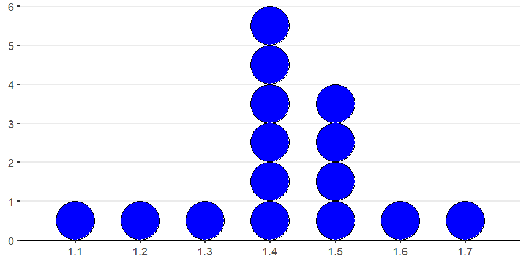
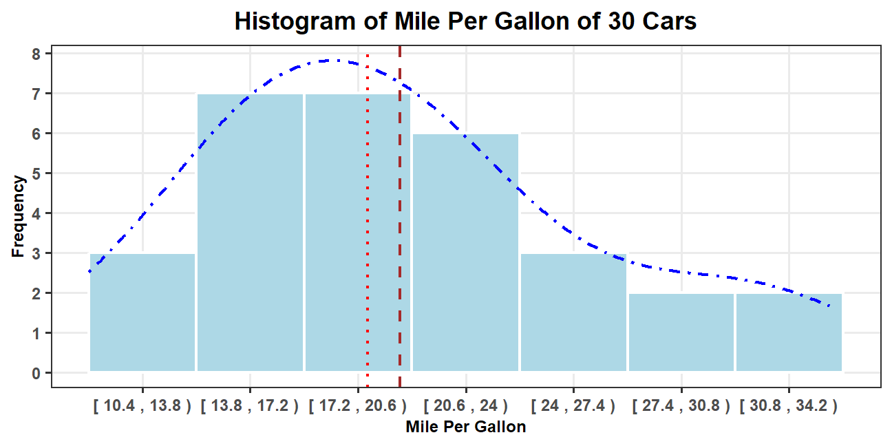
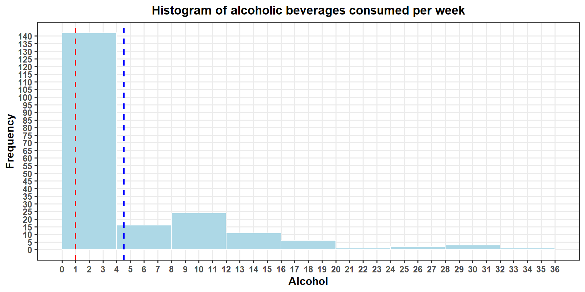

## Learning Goals {.unnumbered}

- Create and interpret graphs (dot plots, histograms, pie charts, bar charts) as a means of summarizing and communicating data meaningfully.

- Identify the shape of a distribution (right-skewed, left-skewed, symmetric, or uniform).

---

## Distribution of Numerical Data

- In data analysis, one goal is to describe **patterns** (known as the **distribution**) of the variable in the data set and create a useful summary about the set.

- To describe patterns in data, we use descriptions of **shape**, **center**,
and **spread**. We also describe exceptions to the pattern. We call these exceptions **outliers**.

::: {.center}
  {height=60%}
:::

::: {.remark}
The center of a distribution may refer to the mean, that is, the weight balancing point; the median, that is, the 50/50 breaking points; or a mode, that is, a peak. For a geometric explanation, see [Mean, Median and Mode in Distributions: Geometric Aspects](https://openpress.usask.ca/introtoappliedstatsforpsych/chapter/3-1-central-tendency-mean-median-mode/)
:::

---

## Dot Plots

A **dot plot** includes all values from the data set, with one dot for each occurrence of an observed value from the set.

**How to Construct**

1. Draw a horizontal line and mark it with an appropriate measurement scale.
2. Locate each value in the data set along the measurement scale, and represent it by a dot. Stack the dots vertically if the value appear multiple times.

---

## Example: Petal Lengths of Iris Flower

The data set contains 15 petal lengths of iris flower. Create a dot plot to describe the distribution of petal lengths.

::: {.center}
1.4, 1.4, 1.3, 1.5, 1.4, 1.7, 1.4, 1.5, 1.4, 1.5, 1.5, 1.6, 1.4, 1.1, 1.2
:::

**Solution:** For each number in the data set, we draw a dot. We stack dots of the same value from bottom to up.

::: {.center}

:::

---

## Practice: Heights of Cherry Trees {.unnumbered}

The data set contains the heights of 20 Black Cherry Trees. Create a dot plot to describe the distribution of the heights.

::: {.center}
64, 69, 71, 72, 74, 74, 75, 76, 76, 77, 78, 80, 80, 80, 80, 81, 82, 85, 86, 87
:::

---

## Histograms (1 of 2)

- Histograms are frequently used to describe large sets of numerical data, in particular, data of a continuous variable.

- A **histogram** consists of a horizontal axis, a vertical axis and adjoining vertical bars. All bars have the same width. The horizontal axis is labeled and scaled so that the width of a bar is 1. The vertical axis is then scaled accordingly so that the area of the bar is the frequency or the relative frequency.

- To construct a histogram, we need to decide boundary of bars which forms intervals, called bins or classes and find the **frequency** of values in each bin.

- A **frequency distribution** is a table which contains bins, frequencies and **relative frequencies** which are proportions (percentage) defined by the formula
  $$
    \text{Relative frequency} =\frac{\text{Class frequency}}{\text{Sample size}}.
  $$

---

## Histograms (2 of 2)

- The lower boundary of a bin is called a **lower bin limit**. The upper boundary of a bin is called an **upper bin limit**.
  
- The **bin width** is the distance between the lower (or upper) bin limits of two consecutive bins.

- The difference between the maximum and the minimum data entries is called the **range**.

- The relation between number of bins, bin width, and the range is roughly $\text{number of bins}\times \text{bin width} \approx \text{range}$.
  
- The **midpoint** of a bin is the half of the sum of the lower and upper limits of the bin.

- Bin limits should be chosen so that each value of the data is in exactly one bin. There are different conventions to construct bins.

---

## Conventions on Constructing Bins

- Textbook convention for a continuous variable: Take an appropriate bin width, take the first lower bin as the minimum, and then take left closed and right opened intervals as bins.

- Textbook convention for a discrete variable: Take an appropriate bin width and take the first lower bin limit to be a value slightly smaller than the minimum minus of the data set.

- Excel convention (roughly): take left opened and right closed intervals.

::: {.remark}

1. Histograms are usually used for continuous data. Variables that take discrete numeric values can be plotted with either a bar chart or histogram, depending on context.
2. There are also different conventions to determine the number of bins or bin width.
3. The choice of bin width (or the number of bins) has a more significant impact on the histogram than the method used to determine bin limits.
4. It's often helpful to visualize the data using different binning strategies.

:::

---

## Example: Histogram of mpg (1 of 2)

The following data set show the mpg (mile per gallon) of $30$ cars.  Construct a frequency table and frequency histogram for the data set using $7$ bins.

::: {.center}
21, 21, 22.8, 21.4, 18.7, 18.1, 14.3, 24.4, 22.8, 19.2, 17.8, 16.4, 17.3, 15.2, 10.4, 10.4, 14.7, 32.4, 30.4, 33.9, 21.5, 15.5, 15.2, 13.3, 19.2, 27.3, 26, 30.4, 15.8, 19.7
:::

**Solution:**

- Find the range using $\text{Range}=\text{maximum}-\text{minimum}$. In this example, the minimum is $10.4$, the maximum is $33.9$, and the range is $33.9-10.4=23.5$.
- The bin width can be taken between $\frac{\mathrm{range}}{k}$ and $\frac{\mathrm{range}}{k-1}$, where $k$ is the number of bins. In this example, we may take the bin width as $3.4$ which is between $\frac{23.5}{7}\approx 3.357$ and $\frac{23.5}{7-1}\approx 3.917$.
- Take the first lower bin limit as the minimum $10.4$. Add the bin width $3.4$ recursively to get all lower bin limits: 10.4, 13.8, 17.2, 20.6, 24, 27.4, 30.8. The upper limits can be taken as 13.8, 17.2, 20.6, 24, 27.4, 30.8, 34.2.

---

## Example: Histogram of mpg (2 of 2)
<!-- 
**Solution:**(continued) -->

::::: {.row}
::: {.pull-left}

- Construct a frequency distribution table

<table>
 <thead>
  <tr>
   <th style="text-align:center;"> Bin </th>
   <th style="text-align:center;"> Frequency </th>
  </tr>
 </thead>
<tbody>
  <tr>
   <td style="text-align:center;"> [ 10.4 , 13.8 ) </td>
   <td style="text-align:center;"> 3 </td>
  </tr>
  <tr>
   <td style="text-align:center;"> [ 13.8 , 17.2 ) </td>
   <td style="text-align:center;"> 7 </td>
  </tr>
  <tr>
   <td style="text-align:center;"> [ 17.2 , 20.6 ) </td>
   <td style="text-align:center;"> 7 </td>
  </tr>
  <tr>
   <td style="text-align:center;"> [ 20.6 , 24 ) </td>
   <td style="text-align:center;"> 6 </td>
  </tr>
  <tr>
   <td style="text-align:center;"> [ 24 , 27.4 ) </td>
   <td style="text-align:center;"> 3 </td>
  </tr>
  <tr>
   <td style="text-align:center;"> [ 27.4 , 30.8 ) </td>
   <td style="text-align:center;"> 2 </td>
  </tr>
  <tr>
   <td style="text-align:center;"> [ 30.8 , 34.2 ) </td>
   <td style="text-align:center;"> 2 </td>
  </tr>
</tbody>
</table>
:::

:::: {.pull-right}

- Graph the histogram using the frequency distribution table.

::: {.center}

:::

::: {style="margin-top: 1em; font-size: 75%;"}
The blue dot-dash curve is called the density curve, the brown dashed line is over the mean, the red dotted line is over the median.
:::

::::
:::::

---

## Some Remarks on Histogram

- Avoid histograms with large bin widths and small bin widths. [See Histogram 2 of 4 in Concepts in Statistics for an interactive demonstration](https://courses.lumenlearning.com/wmopen-concepts-statistics/chapter/histograms-2-of-4/)

- Tet the bin width for $k$ bins, one convention is to choose a number with the same or one more decimal place that is greater than $\frac{\text{range}}{k}$, but no more than $\frac{\text{range}}{k-1}$ as the bin width.

- To determine the number of bins, there are practical rules. For example, the Rice rule takes the bin number $k$ as the **round up of $n^{1 / 3}$**.
  
  See the [Statistic How To](https://www.statisticshowto.datasciencecentral.com/choose-bin-sizes-statistics/) page for rules on choosing bin width.

- The convenient starting point should not be too much smaller than the minimum. The choice of a starting point together with a bin width affects the shape of the histogram. It is better to experiment with different choices.

- The area of a bar represents the relative frequency for the bin. There should be *no space* between any two bars.

---

## Practice: Petal Lengths of Irises {.unnumbered}

The following data set show the petal length of 20 irises. Construct a frequency table and frequency histogram for the data set using 6 bins.

::: {.center}
1.4, 5.4, 1.2, 4.5, 6.1, 1.5, 4.7, 1.4, 5.6, 5.2, 1.3, 6.3, 5.1, 5.6, 5, 6.7, 1.4, 1.6, 1.5, 1.5
:::

---

## Stem-and-Leaf Plots

A stem-and-leaf plot is a kind of histogram that lets you see all your data instead of just class frequency information. The leading digit(s) form stems and the "tailing digits" form leaves.

**How to Construct**

- Select one or more leading digits for the stem values. The trailing digits become the leaves. Trailing digits for the same stem may further break into two leaves.
- List possible stem values in a vertical column.
- Record the leaf for every observation beside the corresponding stem value.
- Indicate the units for stems and leaves someplace in the display.

---

## Example: Heights of Cherry Trees

Consider the following data of heights of 10 cherry trees. Create a stem-and-leaf plot and describe the distribution.

::: {.center}
1.4, 5.4, 1.2, 4.5, 6.1, 1.5, 4.7, 1.4, 5.6, 5.2, 1.3, 6.3, 5.1, 5.6, 5, 6.7, 1.4, 1.6, 1.5, 1.5
:::

**Solution:**  
::: {style="width:45%; margin-top: -1em;"}


```
  The decimal point is at the |
  1 | 234445556
  2 | 
  3 | 
  4 | 57
  5 | 012466
  6 | 137
```
:::

---

## Common Descriptions of Shape Distribution

- **Right skewed** (or reverse $J$-shaped): A right-skewed distribution has a lot of data at lower variable values. (Example: the histogram example.)

- **Left skewed** (or $J$-shaped): A left skewed distribution has a lot of data at higher variable values with smaller amounts of data at lower variable values.

- **Symmetric with a central peak (or bell-shaped)**: A
central peak with a tail in both directions. A bell-shaped distribution has a lot of data in the center with smaller amounts of data tapering off in each direction. (Example: the petal length example.)

- **Uniform**: A rectangular shape, the same amount of
data for each variable value.

- For examples of left skewed and uniform distributions, please see the example in [dotpolt 2 of 2 in Concepts in Statistics](https://courses.lumenlearning.com/wmopen-concepts-statistics/chapter/dotplots-2-of-2/)

---

## Practice: Shapes of Distributions {.unnumbered}

Statistics are used to compare and sometimes identify authors. The following lists shows a simple random sample that compares the letter counts for three authors.

Terry: 7, 9, 3, 3, 3, 4, 1, 3, 2, 2

Davis: 3, 4, 4, 4, 1, 4, 5, 2, 3, 1

Maris: 2, 3, 4, 4, 4, 6, 6, 6, 8, 3

Create a dot plot for each sample and describe the shape of the distribution of each sample.

::: {.footmark}
Source: [Example 2.7.1, OpenStax Introductory Statistics](https://stats.libretexts.org/Bookshelves/Introductory_Statistics)
:::

---

## Measure of Centers

- **Mean**: The mean is the average, this is the quotient of the total sum by the total number.

- **Median**: The median is the middle of
the data when all the values are listed in order. The median divides the data into two equal-sized groups.

- **Mode**: The mode is the value that has the most occurrence in the data set.

- Use the *mean* as a measure of center only for distributions that are *reasonably symmetric* with a central peak. When outliers are present, the mean is not a good choice.

- Use the *median* as a measure of center for all *other cases*.
  
- We need to use a graph to determine the shape of the distribution. So graph the data first.

---

## Mean and Median for Distributions in Different Shapes

<iframe src="https://istats.shinyapps.io/MeanvsMedian/" width="100%" height="550px" data-external="1"></iframe>

::: {.footmark}
Source: https://istats.shinyapps.io/MeanvsMedian/
:::

---

## Practice: Appropriate Measure of Center {.unnumbered}

A student survey was conducted at a major university. The following histogram shows distribution of alcoholic beverages consumed in a typical week.
1. What is the typical number of drinks a student has during a week?
2. Do the data suggest that drinking is a problem in this university?
::: {.center}

:::

::: {.footmark}
*The red line is over the median and the blue line is over the mean.*
:::

---

## Frequency Distribution for Categorical Data

- A **frequency distribution for categorical data** is a table that displays the possible categories along with the associated frequencies and/or relative frequencies.

- The **frequency** of a category is the number of occurrences of elements in the category.

- The proportion of a frequency to the size of the population or the sample is also called the **relative frequency**.

- A **relative frequency distribution** is a frequency distribution that includes relative frequencies.

---

## Visualization of Categorical Data

- A **bar chart** consists of bars (rectangles), each represent a category and the area of each bar is constantly proportional to the relative frequency of that category.

- A **pie chart** is a pie with sectors represents categories and the area of each sector is proportional to the relative frequency of that category.

- **Stacked bar char** (segmented bar chart) is a bar divided into segments, with each segment representing a category and the area of the segment is proportional to the relative frequency for that category.

---

## Example: Distribution of Majors (1 of 2)

**Example:** The counts of majors of 100 students in a sample are shown in the table. Visualize the data using a bar, pie and stacked bar chart.

::: {.center}
| Grade | Frequency (Counts) |
| ----- | ------ |
| Art     | 30      |
| Engineering | 50      |
| Science    | 20      |
:::

**Solution:** The relative frequency table is shown below.  

::: {.center}

| Major       | Frequency| Relative Frequency|
| ----------- | -------------------- | ------------------------------- |
| Art         | 30                   | 30%                             |
| Engineering | 50                   | 50%                             |
| Science     | 20                   | 20%                             |
| Total       | 100                  | 100%                             |
:::

---

## Example: Distribution of Majors (2 of 2)

**Solution:**

:::: {.row}
::: {.center width=32%}
Bar chart
{80%}
:::

::: {.center width=32%}
Pie chart
{width=85%}
:::

::: {.center width=32%}
Stacked bar chart
{width=80%}
:::
::::

---

## Practice: Passengers on Titanic {.unnumbered}

The following data table summarize passengers on Titanic. Using a chart to describe the data table.


| Class | Passengers |
|:-----:|:----------:|
|  1st  |    325     |
|  2nd  |    285     |
|  3rd  |    706     |
| Crew  |    885     |

---

<!--# class="middle center"-->

::: {.part}
Lab Instructions in Excel
:::

---

## Frequency Tables

In Excel, to create a frequency table for a data array, we need a bin array. The values in a bin array in Excel are the first $k-1$ upper bin limits. For example, if the bin array consists of 30, 40, and 50, then the bins will be $[\text{min},30]$, $(30,40]$, $(40, 50]$, $(50, \infty)$.

With a data array and a bin array, the Excel function `FREQUENCY(data_array, bins_array)` can be used to create a frequency table.

Suppose the data set is in `column A` and the bin array is in `column B`.

1. In `column C`, select a column array of $k$ cells, then enter `=FEQUENCY(` 
2. select the data values
3. in the formula bar, enter the symbol comma `,`
4. select the bin array
5. in the formula bar, enter `)`.

Hit the `Enter` (`Ctrl + Enter` in older versions), you will get a frequency table.

---

## Charts in Excel

Excel has many built-in chart functions. To create a charts, 

1. Select the data array/table
2. Under the `Insert` tab, click on an appropriate chart in the `Charts` command set.

The appearance of chart can be changed after being created.

---

## Histogram (1 of 2)

1. Select the data

2. On the `Insert` tab, in the `Charts` group, from the `Insert Statistic Chart` dropdown list, select `Histogram`:

   **Note:** The histogram contains a special first bin which always contains the smallest number. This is different from many textbooks.

To **format the histogram chart** is similar to format a Pie chart. For example, you can change bin width from `Format Axis`.

1. Right-click on the horizontal axis and choose `Format Axis` in the popup menu:

2. In the `Format Axis` pane, on the `Axis Options` tab, you may try different options for bins. 

---

## Histogram (2 of 2)

::: {.remark}

- Excel using a different convention to create histogram. The first bin is a closed interval and other bins are left open and right closed intervals.

- Select the **Overflow bin** checkbox and type the number, all values above this number will be added to the last bin.

- Select the **Underflow bin** checkbox and type the number, all values below and equal to this number will be added to the first bin.
- Histograms show the shape and the spread of numerical data. For categorical data, discrete by its definition, bar charts are usually used to represent category frequencies.

:::

---

## The `Analysis ToolPak`

Suppose your data set is in `Column A` in Excel.

- In the cell `B1`, put the *first lower bin limit*, which is a number slightly less than the minimum but has more decimal places than the data set.

- Create upper bin limits in column C.

- In Data menu, look for the Data Analysis ToolPak (if not, go to File > Options > Add-ins > Manage Excel Add-ins, check Analysis ToolPak). In the popup windows, find Histogram.

- In the input range, select your data set. In the bin range, select upper bins.

- Check Chart Output and hit OK. You will see the frequency table and histogram in Sheet 2.

- Change the gap between bars. Right click a bar and choose `Format Data Series...` and change the `Gap Width` to 2% or 1%.

---

## Dotplot

- If you have a raw data set, follow the same procedure a creating a histogram but with a bin width equal the same accuracy of the data. For example, if you data set consists of integers, then choose 1 as the bin-width.

- Change the format of bars in the histogram.

  - Right click a bar and select `Format Data Series...`.
  
  - Find `Fill & Line` and select both `Picture or texture fill` and `Stack and Scale with`.
  
  - Click the button `Oneline...` and input *dot* in `search bing` and hit enter.
  
  - Select a picture you like and you will get a dot-plot.

---

## Lab Example {.unnumbered}

Describe the distribution of percentage of college students attending college in home states. (To be demonstrated in-class)

::: {.center}

93, 92, 91, 91, 90, 90, 90, 90, 89, 89,
89, 89, 89, 89, 89, 88, 87, 87, 85, 85,
85, 85, 84, 84, 83, 81, 81, 81, 80, 78,
77, 77, 76, 76, 76, 76, 72, 72, 70, 68,
67, 65, 65, 64, 62, 60, 58, 57, 57, 50

:::

::: {.footmark}
Data is taken from Example 3.15 in [Introduction to Statistics and Data Analysis](https://faculty.cengage.com/titles/9781337793612).
:::

---

## Lab Practice {.unnumbered}

Use Excel to complete the following tasks:

1. Create a random sample of 30 two-digit integers.

2. Create a histogram with 6 bins for the sample.

3. Describe the shape of the distribution of the sample of 30 two-digit integers.
