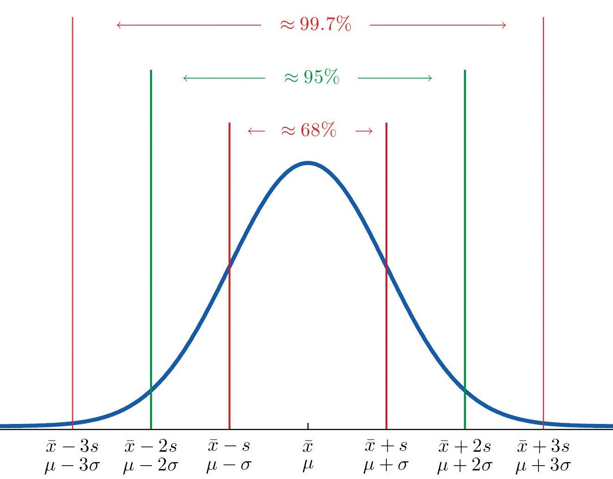

## Learning Goals

- Create and interpret boxplots as a means of summarizing non-symmetric data.

- Calculate and explain the purpose of measures of centers (mean, median), variability (standard deviation, interquartile range).

- Explain the impact of outliers on summary statistics such as mean, median and standard deviation.

---

## Median, Quartiles, Interquartile Range and Outliers

- The three **quartiles**, $Q_1$, $Q_2$, and $Q_3$ are numbers in an ordered data set that divide the data set into four equal parts. The second quartile is known as the **median**.

- **Interquartile Range (IQR for short)** is the measure of variation when using the median to measure center. It is defined as the difference of the third and the first quartiles: $\text{IQR}=Q_3-Q_1$.

- When the center and the spread are measured by the median and the IQR, a value in the data is considered an **outlier** if the value is
  - greater than $Q_3 + 1.5 \cdot \text{IQR}$ or
  - less than $Q_1 − 1.5 \cdot \text{IQR}$.

  **Note:** An outlier in this definition is also called a **mild outlier**. An outlier that is more extreme than $Q_1 + 3 \cdot \text{IQR}$ or $Q_3 - 3 \cdot \text{IQR}$ is also called **extreme outlier**.

- The minimum, $Q_1$, $Q_2$, $Q_3$ and maximum are known as the "**five-number summary**" of the data set.

- The difference of maximum and minimum is called the **range**.
  
---

## Example: Median, IQR and Outliers

Find the median, quartiles, IQR and outliers (if they exist) of the sample height of 15 trees.

::: {.center}
70, 65, 63, 72, 81, 83, 66, 75, 80, 75, 79, 76, 76, 69, 75
:::

**Solution:**

- Sort the data set from small to large.
::: {.center}
63, 65, 66, 69, 70, 72, 75, 75, 75, 76, 76, 79, 80, 81, 83
:::
- Find the median $Q_2$. The sample size is 15. The middle of the ordered data set is the $\lceil 15/2 \rceil=8$-th number which is 75.
- Find $Q_1$ and $Q_3$. $Q_1$ is the median of the numbers less than the median. $Q_3$ is the median of the number greater than the median. In this example, $Q_1$ is the 4-th number 69. $Q_3$ is the 4-th to the last, that is 79.
- $\text{IQR}=Q_3-Q_1=79-69=10$.
- Since $Q_1-1.5\text{IQR}=69-1.5\cdot 10=54$ and $Q_3+1.5\text{IQR}=79-1.5 \cdot 10=94$, there is no outlier in this sample.

---

## Practice: Five-number Summary, Range and IQR {.unnumbered}

:::
<iframe src="https://www.myopenmath.com/embedq2.php?id=899254&amp;seed=2020&amp;showansafter" width="100%" height="550px" data-external="1"></iframe>
:::

---

## Box Plot

- A **box plot** shows a "five-number summary" of the data set. It contains a box, two whiskers and dots (for outliers).

- To create the boxplot for a distribution,
  
  - Draw a box from $Q_1$ to $Q_3$.
  
  - Draw a vertical line in the box at the median.
  
  - Extend a tail from $Q_1$ to the smallest value that is not an outlier and from $Q_3$ to the largest value that is not an outlier.
  
  - Indicate outliers with a solid dot.

---

## Example: Box Plot - Ages of Best Oscar Winners (1/2)

Create the boxplot for the ages of 32 best actor oscar winners (1970–2001).

::: {.center}
31, 32, 32, 33, 35, 36, 37, 37, 38, 38, 39, 40, 40, 40, 42, 42, 43, 43, 45, 45, 46, 47, 48, 48, 51, 55, 55, 56, 60, 60, 61, 76
:::

--

**Solution:** We may use Excel to find the five-number summary.

- The quartiles are 
  $$Q_2=42.5,\quad Q_1=37.5,\quad Q_3=49.5.$$
  The interquartile range and the bounds for mild outliers are
  $$\text{IQR}=12, \quad Q_1-1.5\text{IQR}= 19.5, \quad Q_3+1.5\text{IQR}=67.5.$$

- The smallest number that is not an outlier is 31. The largest number that is not an outlier is 61. Those two numbers bound the whiskers.

- The number 76 is a mild outlier because
  $$Q_3+1.5\text{IQR}< 76 < Q_3+3\text{IQR}.$$

---

## Example: Box Plot - Ages of Best Oscar Winners (2/2)

**Solution: (continued)**

- The boxplot is shown below.

::: {.center}

```{=html}
<div class="plotly html-widget html-fill-item-overflow-hidden html-fill-item" id="htmlwidget-1349b6a72f678724c19c" style="width:864px;height:345.6px;"></div>
<script type="application/json" data-for="htmlwidget-1349b6a72f678724c19c">{"x":{"data":[{"x":[43,40,48,48,56,38,60,32,40,42,37,76,39,55,45,35,61,33,51,32,43,55,42,37,38,31,45,60,46,40,36,47],"y":[1,1,1,1,1,1,1,1,1,1,1,1,1,1,1,1,1,1,1,1,1,1,1,1,1,1,1,1,1,1,1,1],"hoverinfo":"x","type":"box","fillcolor":"rgba(255,255,255,1)","marker":{"opacity":null,"outliercolor":"rgba(0,0,0,1)","line":{"width":1.8897637795275593,"color":"rgba(0,0,0,1)"},"size":5.6692913385826778},"line":{"color":"rgba(51,51,51,1)","width":1.8897637795275593},"showlegend":false,"xaxis":"x","yaxis":"y","orientation":"h","frame":null}],"layout":{"margin":{"t":42.574729712925304,"r":10.62681610626816,"b":70.144675748624763,"l":15.940224159402241},"plot_bgcolor":"rgba(255,255,255,1)","paper_bgcolor":"rgba(255,255,255,1)","font":{"color":"rgba(0,0,0,1)","family":"","size":21.253632212536321},"xaxis":{"domain":[0,1],"automargin":true,"type":"linear","autorange":false,"range":[28.75,78.25],"tickmode":"array","ticktext":["31.0","37.5","42.5","49.5","61.0","76.0"],"tickvals":[31,37.5,42.5,49.5,61,76],"categoryorder":"array","categoryarray":["31.0","37.5","42.5","49.5","61.0","76.0"],"nticks":null,"ticks":"outside","tickcolor":"rgba(51,51,51,1)","ticklen":5.3134080531340802,"tickwidth":0.96607419147892382,"showticklabels":true,"tickfont":{"color":"rgba(77,77,77,1)","family":"","size":17.002905770029063},"tickangle":-0,"showline":true,"linecolor":"rgba(0,0,0,1)","linewidth":1.594022415940225,"showgrid":false,"gridcolor":null,"gridwidth":0,"zeroline":false,"anchor":"y","title":{"text":"Age","font":{"color":"rgba(0,0,0,1)","family":"","size":21.253632212536321}},"hoverformat":".2f"},"yaxis":{"domain":[0,1],"automargin":true,"type":"linear","autorange":false,"range":[0.40000000000000002,1.6000000000000001],"tickmode":"array","ticktext":[""],"tickvals":[1],"categoryorder":"array","categoryarray":[""],"nticks":null,"ticks":"","tickcolor":null,"ticklen":5.3134080531340802,"tickwidth":0,"showticklabels":false,"tickfont":{"color":null,"family":null,"size":0},"tickangle":-0,"showline":false,"linecolor":null,"linewidth":0,"showgrid":false,"gridcolor":null,"gridwidth":0,"zeroline":false,"anchor":"x","title":{"text":"","font":{"color":"rgba(0,0,0,1)","family":"","size":21.253632212536321}},"hoverformat":".2f"},"shapes":[{"type":"rect","fillcolor":null,"line":{"color":null,"width":0,"linetype":[]},"yref":"paper","xref":"paper","x0":0,"x1":1,"y0":0,"y1":1}],"showlegend":false,"legend":{"bgcolor":"rgba(255,255,255,1)","bordercolor":"transparent","borderwidth":2.7487473156764488,"font":{"color":"rgba(0,0,0,1)","family":"","size":17.002905770029063}},"hovermode":"closest","barmode":"relative"},"config":{"doubleClick":"reset","modeBarButtonsToAdd":["hoverclosest","hovercompare"],"showSendToCloud":false},"source":"A","attrs":{"3bd029db7506":{"x":{},"y":{},"type":"box"}},"cur_data":"3bd029db7506","visdat":{"3bd029db7506":["function (y) ","x"]},"highlight":{"on":"plotly_click","persistent":false,"dynamic":false,"selectize":false,"opacityDim":0.20000000000000001,"selected":{"opacity":1},"debounce":0},"shinyEvents":["plotly_hover","plotly_click","plotly_selected","plotly_relayout","plotly_brushed","plotly_brushing","plotly_clickannotation","plotly_doubleclick","plotly_deselect","plotly_afterplot","plotly_sunburstclick"],"base_url":"https://plot.ly"},"evals":[],"jsHooks":[]}</script>
```
:::

---

## Practice: Five-Number Summary from the Boxplot {.unnumbered}

<iframe src="https://www.myopenmath.com/embedq2.php?id=899261&amp;seed=5824&amp;showansafter&amp;height=550px&amp;frame_id=boxplot" width="100%" height="550px" data-external="1"></iframe>

---

## Notations and Calculations about Mean

- Sigma notation: in math, we denote the sum of values  $x_1$, $x_2$, $\dots$, $x_n$ of a variable $x$ by $\sum\limits_{i=1}^n x_i$ or simply by $\sum x$.

- The **population mean** is $\mu= \frac{\sum x}{N}$, where $N$ is the **population size**, i.e the number of elements in the population.  

    The notation $\mu$ reads as mu.

- The **sample mean** is $\bar{x}=\frac{\sum{x}}{n}$, where $n$ is the **sample size**. The notation $\bar{x}$ reads as $x$--bar.

---

## Example: Mean City mpg

Find the mean city mpg for a sample of 10 cars.
::: {.center}
18, 21, 20, 21, 16, 18, 18, 18, 16, 20
]

--

**Solution:** The mean is

$$\bar{x}=\frac{18+21+20+21+16+18+18+18+16+20}{10}=18.6.$$

The mean mpg of the 10 cars is 18.6 mpg.

---

## Weighted Mean

- The weighted mean of a set of numbers $\{x_1, \dots, x_n\}$ with weights $w_1$, $w_2$, ..., $w_n$ is defined as  $$\frac{\sum w_ix_i}{\sum w_i}.$$

- The mean of a frequency table is weighted mean $\bar{x}=\frac{\sum f x}{n}$, where $x$ is an element with frequency $f$ and $n$ is the sample size.

---

## Example: Course Overall Grade

In a course, the overall grade is determined in the following way: the homework average counts for 10%, the quiz average counts for 10%, the test average counts 50% , and the final exam counts for 30%. What's the overall grade of the student who earned  92 on homework, 95 on quizzes, 90 on tests and 93 on the final.

--

**Solution:** The overall grade is the weighted mean

$$\frac{\sum w_ix_i}{\sum w_i}=\frac{0.1\cdot 92+0.1\cdot 95+0.5\cdot 90+0.3\cdot 93}{0.1+0.1+0.5+0.3}=91.6.$$

---

## Practice: Mean Petal Width {.unnumbered}

Find the average petal width for a sample of  10 iris followers.
  
::: {.center}
0.2, 2.1, 0.2, 1.7, 2.3, 0.3, 1.2, 0.2, 1.8, 2.3
:::

---

## Practice: Calculate a Mean Using The Weighted Mean Formula {.unnumbered}

Find the mean from the dot plot of sepal length for a sample of 10 iris flowers.
::: {.center}

:::


<!-- 
Practice: Estimate the mean from a histogram

Estimate the average highway mpg using the histogram of a sample of 20 cars.

::: {.center}

::: 
-->

---

## Practice: Weighted mean - calculate final grade {.unnumbered}

:::
<iframe src="https://www.myopenmath.com/embedq2.php?id=279978&amp;seed=2020&amp;showansafter" width="100%" height="550px" data-external="1"></iframe>
:::

---

## Measure of Variation about Population Mean

- The **deviation** of an entry $x$ in a population data set is the difference $x-\mu$, where $\mu$ is the mean of the population.
  
- The **population variance** of a population of $N$ entries is defined as
  $$
    \text{VAR.P}=\sigma^2=\dfrac{\sum(x-\mu)^2}{N}.
  $$

- The **population standard deviation** is
  $$
    \text{STDEV.P}=\sigma=\sqrt{\dfrac{\sum(x-\mu)^2}{N}}.
  $$

---

## Measure of Variation about Sample Mean

- The **deviation** of an entry $x$ in a sample data set is the difference $x-\bar{x}$, where $\bar{x}$ is the mean of the sample.

- The **sample variance** and **sample standard deviation** are defined similarly
  $$
    \text{VAR.S}=s^2=\dfrac{\sum(x-\bar{x})^2}{n-1}, \qquad
    \text{STDEV.S}=s=\sqrt{\dfrac{\sum(x-\bar{x})^2}{n-1}},
  $$
  where $n$ is the sample size.

- **Rounding rule:** for mean, variance and standard deviation, we keep at least one more digit than the accuracy of the data set.

**Note:** To measure the spread, one may also use the **mean absolute deviation**
$$MAD=\dfrac{\sum |x-\bar{x}|}{n}.$$
However, the standard deviation has better properties in applications.

---

## Example: Standard deviation - ages of oscar winners

Find the mean and standard deviation ages of a sample of  32 best actor oscar winners (1970–2001).

::: {.center}
31, 32, 32, 33, 35, 36, 37, 37, 38, 38, 39, 40, 40, 40, 42, 42, 43, 43, 45, 45, 46, 47, 48, 48, 51, 55, 55, 56, 60, 60, 61, 76
:::

--

**Solution:** We use the Excel functions `AVERAGE()` and `STDEV.S()` to find the mean and sample standard deviation respectively.
The mean is 44.7. The sample standard deviation is 10.3.

:::
<iframe src="https://www.geogebra.org/material/iframe/id/DS6PUaXy/width/1300/height/800/border/888888/sfsb/true/smb/false/stb/false/stbh/false/ai/false/asb/false/sri/false/rc/false/ld/false/sdz/false/ctl/false" width="100%" height="290px" data-external="1"></iframe>
:::

::: {.footmark}
Source: https://www.geogebra.org/m/DS6PUaXy
:::

---

## Practice: Standard deviation {.unnumbered}

A *sample* of GPAs from ten students random chosen from a college are recorded as follows.

::: {.center}
1.90, 3.00, 2.53, 3.71, 2.12, 1.76, 2.71, 1.39, 4.00, 3.33
:::

Find the standard deviation of this sample.

---

## Mean and Standard Deivation under Linear Transformation

- When we increase values in a data set by a fixed number $c$, the standard deviation of a data set won't change. However, the mean increases by $c$ too.

- When we multiple values in a data set by a factor $k$, the mean and the standard deviation both scale by the factor $k$.

<iframe src="https://www.geogebra.org/material/iframe/id/r25rDxYZ/sfsb/true/smb/false/stb/false/stbh/false/ai/false/asb/false/sri/false/rc/false/ld/false/sdz/false/ctl/false" width="100%" height="300px" data-external="1"></iframe>

::: {.footmark}
Source: https://www.geogebra.org/m/r25rDxYZ
:::

---

## Effect of Changes of Data on Statistical Measures

<iframe src="https://www.geogebra.org/material/iframe/id/fenbj3qZ/width/910/height/628/border/888888/sfsb/true/smb/false/stb/false/stbh/false/ai/false/asb/false/sri/false/rc/false/ld/false/sdz/false/ctl/false" width="100%" height="550px" data-external="1"></iframe>

::: {.footmark}
Source: https://www.geogebra.org/m/fenbj3qZ
:::

---

## Practice: Standard deviation under a transformation {.unnumbered}

A sample of the highest temperature of 10 days has a standard deviation $5^\circ\mathrm{C}$ in Celsius.

1. If we want to know the standard deviation in Fahrenheit, do we need to recalculate using the sample?

2. What is the standard deviation in Fahrenheit.
  
---

## The Empirical Rule

If a data set has an **approximately bell-shaped** distribution, then

1. approximately 68% of the data lie within one standard deviation of the mean.

2. approximately 95% of the data lie within two standard deviations of the mean.

3. approximately 99.7% of the data lies within three standard deviations of the mean.

::: {.center}
{width=35%}
:::

::: {.footmark}
Image source: [Figure 2.16 "The Empirical Rule"  in Introductoray Statistics](https://saylordotorg.github.io/text_introductory-statistics/s06-05-the-empirical-rule-and-chebysh.html#fwk-shafer-ch02_s05_s01_f02)
:::

---

## Chebyshev’s Theorem

For any numerical data set, at least $1−1/k^2$
of the data lie within $k$ standard deviations of the mean, where $k$ is any positive whole number that is at least 2.

::: {.center}
{width=45%}
:::

::: {.footmark}
Image source: [Figure 2.19 "Chebyshev’s Theorem"  in Introductoray Statistics](https://saylordotorg.github.io/text_introductory-statistics/s06-05-the-empirical-rule-and-chebysh.html#fwk-shafer-ch02_s05_s02_f01)
:::

---

## Example: Applications of the Empirical Rule

A population data set with a bell-shaped distribution has mean $\mu = 6$ and standard deviation $\sigma = 2$. Find the approximate proportion of observations in the data set that lie:

1. between 4 and 8;
2. below 4.

--

**Solution:** Apply the Empirical Rule, there are 68% of data lie between 6-2=4 and 6+2=8. Since the distribution is symmetric, then 34% of data lie between 4 and 6, and 34% of data lie between 6 and 8. Then there are only 50%-34%=26% of data lie below 4.

---

## Example: Applications of Chebyshev's Theorem

A sample data set has mean $\bar{x}=6$
and standard deviation $s = 2$. Find the minimum proportion of observations in the data set that must lie
between 2 and 10.

**Solution:** Apply Chebyshev's theorem, there are 75% of data are between $\bar{x}-2s=2$ amd $\bar{x}+2s=10$.

---

## Practice: The empirical rule {.unnumbered}

<iframe src="https://www.myopenmath.com/embedq2.php?id=25941&amp;frame_id=303&amp;resizer=true&amp;seed=2020" width="100%" height="550px" data-external="1"></iframe>

---

## Practice: Chebyshev’s Theorem {.unnumbered}

A sample data set has mean $\bar{x}=10$ and standard deviation $s = 3$. Find the minimum proportion of observations in the data set that must lie between 1 and 19.

::: {.footmark}
    Source: [2.5 The Empirical Rule and Chebyshev’s Theorem in Introductory Statistics](https://saylordotorg.github.io/text_introductory-statistics/s06-05-the-empirical-rule-and-chebysh.html#fwk-shafer-ch02_s05_s01_f02).
:::

---

## Practice: Change of Measures on Transformation of Data {.unnumbered}

A teacher decide to curve the final exam by adding 10 points for each student. Which of
the following statistic will NOT change:  
A. median,   B. mean,   C. interquartile range,   D. standard deviation?  
**Please explain your conclusion.**

---

## Practice: Understand Standard Deviation From Graphs {.unnumbered}

Which distribution of data has the SMALLEST standard deviation? Please explain your conclusion.

::: {.center}

:::

---

<!-- # class="center middle" -->

::: {.part}
Lab Instruction in Excel
:::

---

## Mean, Median, Quartiles and Standard Deviation

- To find the median, you may use the function `MEDIAN()`.

- To find quartiles, you may use the function `QUARTILE.EXC`.
  **Note:** This excel function uses weighted mean for $Q_1$ and $Q_3$ instead of the arithmetic mean we used.

- To find the mean, you may use the function `AVERAGE()`.

- To find the **population** standard deviation, you may use the function `STDEV.P()`.

- To find the **sample** standard deviation, you may use the function `STDEV.S()`.

---

## How to Create a Boxplot in Excel

- Select your data—either a single data series, or multiple data series.

- Click `Insert` > `Insert Statistic Chart` > `Box and Whisker` to create a boxplot.
  
For more information, see [Create a box and whisker chart in Excel 365](https://support.microsoft.com/en-us/office/create-a-box-and-whisker-chart-62f4219f-db4b-4754-aca8-4743f6190f0d)

---

## Lab Practice {.unnumbered}

Consider the following sample that consists of speeds of 20 cars.

::: {.center}
18.7, 21, 15.8, 16.4, 17.3, 18.7, 24.4, 18.7, 22.8, 22.8, 13.3, 15.5, 32.4, 10.4, 19.2, 16.4, 24.4, 15.5, 30.4, 30.4
:::

1. Use Excel to find the mean, median, quartiles and standard deviation of the sample.
2. Create a box-plot for the sample.
