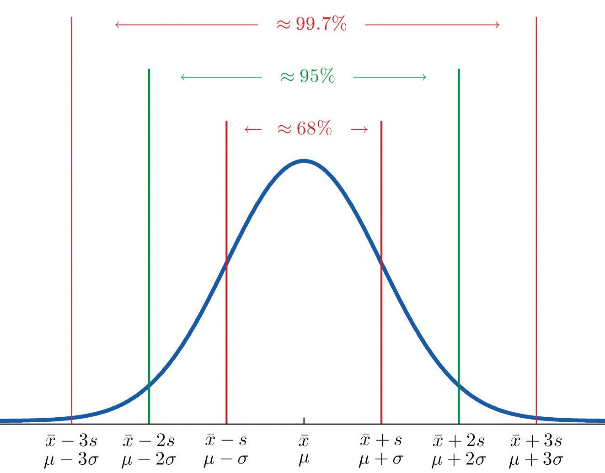
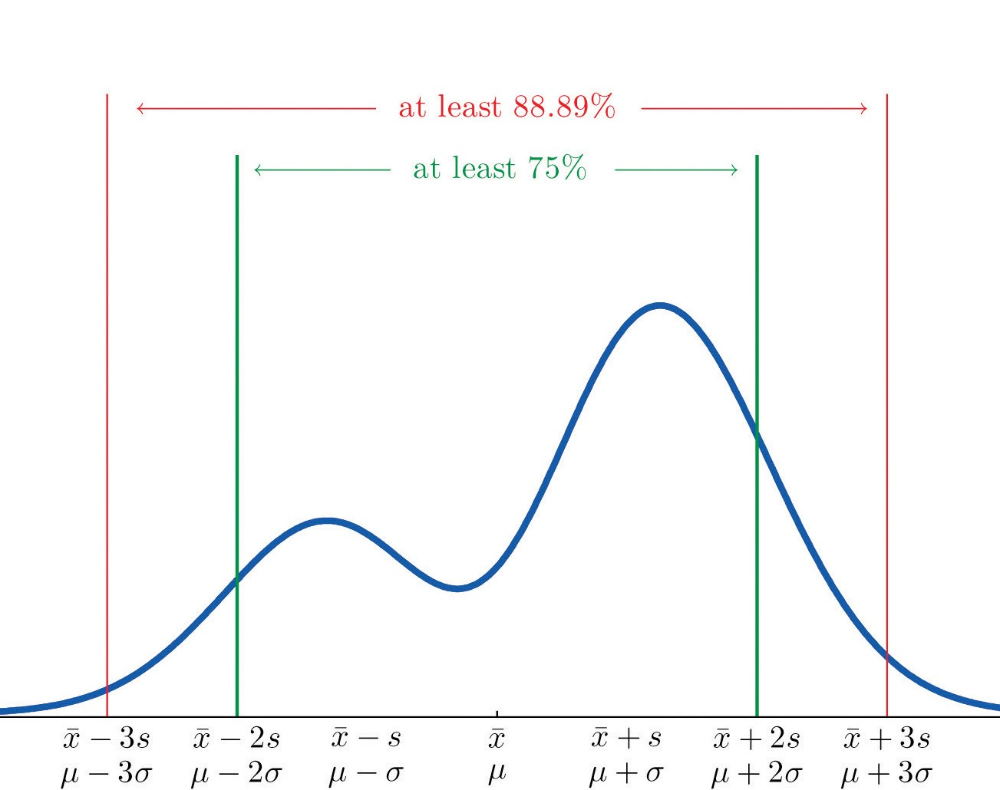
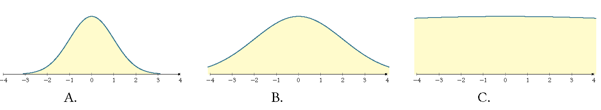

```{r, echo=FALSE, warning=FALSE}
knitr::opts_chunk$set(comment="#", fig.retina=2)
#library(stats)
#library(kableExtra)
#library(knitr)
#library(formattable)
library(ggplot2)
#library(ggthemes)
#library(ggExtra)
#library(data.table)
library(dplyr, warn.conflicts = FALSE)
library(plotly, warn.conflicts = FALSE)
set.seed(3)
load("Data-Frames-SUNY-Concepts-in-Statistics/actor.RData")
```

## Learning Goals

- Create and interpret boxplots as a means of summarizing non-symmetric data.

- Calculate and explain the purpose of measures of centers (mean, median), variability (standard deviation, interquartile range).

- Explain the impact of outliers on summary statistics such as mean, median and standard deviation.

---

## Quartiles, Interquartile Range and Outliers

- The **second quartile** $Q_2$ of a data set is the median. The **first (lower) quartiles** $Q_1$ is the median of the lower half of the data set. The **third (upper) quartile** $Q_3$ is the median of the upper quartile.
- The **Interquartile Range (IQR for short)** of a data set is the difference of the third and the first quartiles: $\text{IQR}=\text{upper quartile} - \text{lower quartile}$.
- An **outlier** is an observation that is more than $1.5\text{IQR}$ away from the nearest quartile.
- An outlier is an **extreme outlier** if it is more than $3\text{IQR}$ from the nearest quartile and it is a **mild outlier** otherwise.
- The minimum, $Q_1$, $Q_2$, $Q_3$ and maximum are known as the "**five-number summary**" of the data set.
<!-- - The difference of maximum and minimum is called the **range**. -->

---

## Example: Median, IQR and Outliers

Find the median, quartiles, IQR and outliers (if they exist) of the sample height of 15 trees.

::: {.center}
```{r echo=FALSE, results = 'asis'} 
cat(paste(as.vector(head(trees$Height,15)), collapse=", "))
```
:::

**Solution:**

- Sort the data set from small to large.
  ::: {.center}
  ```{r echo=FALSE, results = 'asis'} 
  cat(paste(sort(as.vector(head(trees$Height,15))), collapse=", "))
  ```
  :::
- Find the median $Q_2$: The sample size is 15. The $Q_2$ is the 8-th value 75 in the sorted data.
- Find $Q_1$ and $Q_3$: $Q_1$ is the median of the lower half of values, that is, 4-th value 69. $Q_3$ is the median of the upper half values, that is, the 4-th to the last value 79.
- Find the IQR: $\text{IQR}=Q_3-Q_1=79-69=10$.
- Since $Q_1-1.5\text{IQR}=69-1.5\cdot 10=54$ and $Q_3+1.5\text{IQR}=79-1.5 \cdot 10=94$, there is no outlier in this sample.

---

## Practice: Five-number Summary, Range and IQR {.unnumbered}

::: {.iframecontainer}
`r knitr::include_url('https://www.myopenmath.com/embedq2.php?id=899254&seed=2020&showansafter', height="550px")`
:::

---

## Box Plot

- A **box plot** shows a "five-number summary" of the data set. It contains a box, two whiskers and dots (for outliers).
- To create the boxplot for a distribution,
  
  - Draw a box from $Q_1$ to $Q_3$.
  - Draw a vertical line in the box at the median.  
  - Extend a tail from $Q_1$ to the smallest value that is not an outlier and from $Q_3$ to the largest value that is not an outlier.  
  - Indicate outliers with a solid dot.

---

## Example: Box Plot - Best Oscar Winners (1 of 2)

Create the boxplot for the ages of 32 best actor oscar winners (1970–2001).

::: {.center}
```{r echo=FALSE, results = 'asis'} 
cat(paste(sort(actor_age$Age), collapse=", "))
```
:::

**Solution:** You may use Excel to find the five-number summary.

- The quartiles are $Q_2=42.5$, $Q_1=37.5$, $Q_3=49.5$.

- The interquartile range is $\text{IQR}=12$, and the bounds for outliers are $Q_1-1.5\text{IQR}= 19.5$ and $Q_3+1.5\text{IQR}=67.5$.

- The smallest number that is not an outlier is 31. The largest number that is not an outlier is 61. Those two numbers bound the whiskers.

- The number 76 is a mild outlier because $Q_3+1.5\text{IQR}< 76 < Q_3+3\text{IQR}.$

---

## Example: Box Plot - Best Oscar Winners (2 of 2)

- Based on the five-number summary, the boxplot is shown below.

```{r echo=FALSE, results = 'asis', fig.width=12, fig.asp=0.4, fig.align="center"}
# load("Data-Frames-SUNY-Concepts-in-Statistics/actor.rdata")

boxplot<-ggplot(actor_age, aes(x="", y=Age)) +
  # stat_boxplot(geom = "errorbar") +
  geom_boxplot(outlier.size=5) +
  scale_y_continuous(breaks = c(31, 37.5, 42.5, 49.5, 61, 76)) +
  theme_classic(base_size = 16) +
  xlab("") + 
  coord_flip() +
  theme(# panel.border=element_blank(), 
        axis.line.x = element_line(size = 1.2),
        axis.line.y = element_blank(),
        axis.ticks.y = element_blank(),
        axis.text.y = element_blank()
        )
htmlwidgets::saveWidget(ggplotly(boxplot), "boxplot.html", selfcontained=TRUE)
knitr::include_url("boxplot.html")
```

---

## Practice: Five-Number Summary from the Boxplot {.unnumbered}

::: {.iframecontainer}
`r knitr::include_url('https://www.myopenmath.com/embedq2.php?id=899261&seed=5824&showansafter&height=550px&frame_id=boxplot')`
:::

---

## Notations and Calculations about Mean

- Sigma notation: in math, we denote the sum of values  $x_1$, $x_2$, $\dots$, $x_n$ of a variable $x$ by $\sum\limits_{i=1}^n x_i$ or simply by $\sum x$.

- The **population mean** is $\mu= \frac{\sum x}{N}$, where $N$ is the **population size**, i.e the number of elements in the population.  

    The notation $\mu$ reads as mu.

- The **sample mean** is $\bar{x}=\frac{\sum{x}}{n}$, where $n$ is the **sample size**. The notation $\bar{x}$ reads as $x$--bar.

---

## Example: Mean City mpg

Find the mean city mpg for a sample of 10 cars.

::: {.center}
```{r echo=FALSE, results = 'asis'} 
cat(paste(head(mpg$cty,10), collapse=", "))
```                      
:::

**Solution:** The mean is

$$\bar{x}=\frac{18+21+20+21+16+18+18+18+16+20}{10}=18.6.$$

The mean mpg of the 10 cars is 18.6 mpg.

In Excel, suppose the data are in the column array `A1:A10`, you may use the function `=AVERAGE(A1:A10)` to find the mean.

---

## Weighted Mean

- The weighted mean of a set of numbers $\{x_1, \dots, x_n\}$ with weights $w_1$, $w_2$, ..., $w_n$ is defined as  $$\frac{\sum w_ix_i}{\sum w_i}.$$

- The mean of a frequency table is weighted mean $\bar{x}=\frac{\sum f x}{n}$, where $x$ is an element with frequency $f$ and $n$ is the sample size.

---

## Example: Course Overall Grade

In a course, the overall grade is determined in the following way: the homework average counts for 10%, the quiz average counts for 10%, the test average counts 50% , and the final exam counts for 30%. What's the overall grade of the student who earned  92 on homework, 95 on quizzes, 90 on tests and 93 on the final.

**Solution:** The overall grade is the weighted mean

$$\frac{\sum w_ix_i}{\sum w_i}=\frac{0.1\cdot 92+0.1\cdot 95+0.5\cdot 90+0.3\cdot 93}{0.1+0.1+0.5+0.3}=91.6.$$

---

## Practice: Mean Petal Width {.unnumbered}

Find the average petal width for a sample of  10 iris followers.
  
::: {.center}
```{r echo=FALSE, results = 'asis'} 
cat(paste(as.vector(sample(iris$Petal.Width,10)), collapse=", "))
```
:::

---

## Practice: Mean from a Dotplot {.unnumbered}

Find the mean from the dot plot of sepal length for a sample of 10 iris flowers.
::: {.center}
```{r echo=FALSE, results = 'asis', fig.width=8, fig.asp=0.3} 
# use the preloaded iris package in R
dfirisSL <- head(iris["Sepal.Length"],10)
# find the max frequency (used `dplyr` package)
yheightSL <- max(count(dfirisSL, Sepal.Length)["n"])
sepalmin <- min(dfirisSL)
sepalmax <- max(dfirisSL)
# basic dotplot (binwidth = the accuracy of the data)
irisPL = ggplot(dfirisSL, aes(x=Sepal.Length), dpi = 600)
irisPL = irisPL + geom_dotplot(binwidth=0.1, method="histodot", dotsize = 0.6, fill="blue")
# use coor_fixed(ration=binwidth*dotsize*max frequency) to setup the right y axis height.
irisPL = irisPL + theme_bw() + coord_fixed(ratio=0.1*0.6*yheightSL)
# tweak the theme a little bit
irisPL = irisPL + theme(
  panel.background=element_blank(),
  panel.border = element_blank(),
  panel.grid.minor = element_blank(),
  # plot.margin=unit(c(-4,0,-4,0), "cm"),
  axis.line = element_line(colour = "black"),
  axis.line.y = element_blank(),
)
# add more tick mark on x axis
irisPL = irisPL + scale_x_continuous(breaks = seq(sepalmin,sepalmax,0.1))
# add tick mark on y axis to reflect frequencies. Note yheightSL is max frequency.
irisPL = irisPL + scale_y_continuous(limits=c(0, 1), expand = c(0, 0), breaks = seq(0, 1,1/yheightSL), labels=seq(0,yheightSL))
# remove x y lables and remove vertical grid lines
irisPL = irisPL + labs(x=NULL, y=NULL) + removeGridX()
irisPL
```
:::

---

## Practice: Course Overall Grade {.unnumbered}

::: {.iframecontainer}
`r knitr::include_url('https://www.myopenmath.com/embedq2.php?id=279978&seed=2020&showansafter', height="550px")`
:::

---

## Population Standard Deviation

- The **deviation** of an entry $x$ in a population data set is the difference $x-\mu$, where $\mu$ is the population mean.
- The **population variance** of a population of $N$ entries is defined as
  $$
    \text{VAR.P}=\sigma^2=\dfrac{\sum(x-\mu)^2}{N}.
  $$
- The **population standard deviation** is
  $$
    \text{STDEV.P}=\sigma=\sqrt{\dfrac{\sum(x-\mu)^2}{N}}.
  $$

---

## Sample Standard Deviation

- The **deviation** of an entry $x$ in a sample data set is the difference $x-\bar{x}$, where $\bar{x}$ is the mean of the sample.
- The **sample variance** and **sample standard deviation** are defined by
  $\text{VAR.S}=s^2=\dfrac{\sum(x-\bar{x})^2}{n-1}$ and $\text{STDEV.S}=s=\sqrt{\dfrac{\sum(x-\bar{x})^2}{n-1}}$ respectively,
  where $n$ is the sample size.
- **Rounding rule:** for mean, variance and standard deviation, we keep at least one more digit than the accuracy of the data set.

**Note:** To measure the spread, one may also use the **mean absolute deviation** $MAD=\dfrac{\sum |x-\bar{x}|}{n}$. However, the standard deviation has better properties in applications.

---

## Example: Mean and SD - Best Oscar Winners (1 of 2)

Find the mean and standard deviation ages of a sample of 32 best actor Oscar winners (1970–2001).

::: {.center}
```{r echo=FALSE, results = 'asis'} 
cat(paste(sort(actor_age$Age), collapse=", "))
```
:::

**Solution:**

We use the Excel functions `AVERAGE()` and `STDEV.S()` to find the mean and sample standard deviation respectively.
The mean is `r round(mean(actor_age$Age),1)`. The sample standard deviation is `r round(sd(actor_age$Age),1)`.

---

## Example: Mean and SD - Best Oscar Winners (2 of 2)

::: {.iframecontainer}
`r knitr::include_url('https://www.geogebra.org/material/iframe/id/DS6PUaXy/width/1300/height/800/border/888888/sfsb/true/smb/false/stb/false/stbh/false/ai/false/asb/false/sri/false/rc/false/ld/false/sdz/false/ctl/false', height='600px')`
:::

::: {.footmark}
Source: https://www.geogebra.org/m/DS6PUaXy
:::

---

## Practice: Standard Deviation - GPA {.unnumbered}

A *sample* of GPAs from ten students random chosen from a college are recorded as follows.

::: {.center}
1.90, 3.00, 2.53, 3.71, 2.12, 1.76, 2.71, 1.39, 4.00, 3.33
:::

Find the standard deviation of this sample.

---

## Mean and SD under Linear Transformation

- When we increase values in a data set by a fixed number $c$, the standard deviation of a data set won't change. However, the mean increases by $c$ too.

- When we multiply values in a data set by a factor $k$, the mean and the standard deviation both scale by the factor $k$.

<!-- ---

## Mean and SD under Linear Transformation (2 of 2) -->

::: {.iframecontainer, style="height: 40vh;"}
`r knitr::include_url('https://www.geogebra.org/material/iframe/id/r25rDxYZ/sfsb/true/smb/false/stb/false/stbh/false/ai/false/asb/false/sri/false/rc/false/ld/false/sdz/false/ctl/false', height='80%')`
:::

::: {.footmark}
Source: https://www.geogebra.org/m/r25rDxYZ
:::

---

## Effect of Changes of Data

::: {.iframecontainer}
`r knitr::include_url('https://www.geogebra.org/material/iframe/id/fenbj3qZ/width/910/height/628/border/888888/sfsb/true/smb/false/stb/false/stbh/false/ai/false/asb/false/sri/false/rc/false/ld/false/sdz/false/ctl/false', height='600px')`
:::

::: {.footmark}
Source: https://www.geogebra.org/m/fenbj3qZ
:::

---

## Practice: Changes Under Transformations {.unnumbered}

A sample of the highest temperature of 10 days has a standard deviation $5^\circ\mathrm{C}$ in Celsius.

1. If we want to know the standard deviation in Fahrenheit, do we need to recalculate using the sample?

2. What is the standard deviation in Fahrenheit.

---

## Standardization

When comparing variables that may have different measurement, it is better to use standardized values. Convert a value to a standard value is called standardization which doesn't change the distribution of the data set.

Let $x$ be a data value, $\bar{x}$ the mean, and $s$ the standard deviation of a data set. The **standard value** (or **$z$-score**) of $x$ is defined as
$$z = \frac{x-\bar{x}}{s}, \quad\text{equivalently}\quad x=zs+\bar{x}$$

In Excel, the $z$-score can be obtained by `=STANDARDIZE(x, mean, sd)`.

---

## Example: Standardized Test Scores

Consider a data set of scores on a standardized test with a mean 70 and standard deviation of 15.

- Find the $z$-score for a score 94.
- What score corresponds to the $z$-score 1.2.

**Solution:**  

- The $z$-score for 90 is $\dfrac{94-70}{15}\approx 1.6$.
- The score for the $z$-score 1.5 is $1.2*15+70=88$.

---

## Practice: Understanding $Z$-score

::: {.iframecontainer}
`r knitr::include_url("https://www.myopenmath.com/multiembedq2.php?id=345978-425748&frame_id=303&resizer=true&seed=2023")`
:::

---

## The Empirical Rule

If a data set has an **approximately bell-shaped** distribution, then

1. approximately 68% of the data lie within one standard deviation of the mean.
2. approximately 95% of the data lie within two standard deviations of the mean.
3. approximately 99.7% of the data lies within three standard deviations of the mean.

::: {.center}
{width="32%"}
:::

::: {.footmark}
Image source: [Figure 2.16 "The Empirical Rule" in Introductoray Statistics](https://saylordotorg.github.io/text_introductory-statistics/s06-05-the-empirical-rule-and-chebysh.html#fwk-shafer-ch02_s05_s01_f02)
:::

---

## Chebyshev’s Theorem

For any numerical data set, at least $1−1/k^2$
of the data lie within $k$ standard deviations of the mean, where $k$ is any positive whole number that is at least 2.

::: {.center}
{width="40%"}
:::

::: {.footmark}
Image source: [Figure 2.19 "Chebyshev’s Theorem" in Introductoray Statistics](https://saylordotorg.github.io/text_introductory-statistics/s06-05-the-empirical-rule-and-chebysh.html#fwk-shafer-ch02_s05_s02_f01)
:::

---

## Example: Applications of the Empirical Rule

A population data set with a bell-shaped distribution has mean $\mu = 6$ and standard deviation $\sigma = 2$. Find the approximate proportion of observations in the data set that lie:

1. between 4 and 8;
2. below 4.

**Solution:**

Apply the Empirical Rule, there are 68% of data lie between 6-2=4 and 6+2=8. Since the distribution is symmetric, then 34% of data lie between 4 and 6, and 34% of data lie between 6 and 8. Then there are only 50%-34%=26% of data lie below 4.

---

## Example: Applications of Chebyshev's Theorem

A sample data set has mean $\bar{x}=6$
and standard deviation $s = 2$. Find the minimum proportion of observations in the data set that must lie
between 2 and 10.

**Solution:**

Apply Chebyshev's theorem, there are 75% of data are between $\bar{x}-2s=2$ amd $\bar{x}+2s=10$.

---

## Practice: The Empirical Rule {.unnumbered}

::: {.iframecontainer}
`r knitr::include_url("https://www.myopenmath.com/embedq2.php?id=25941&frame_id=303&resizer=true&seed=2020")`
:::

---

## Practice: Chebyshev’s Theorem {.unnumbered}

A sample data set has mean $\bar{x}=10$ and standard deviation $s = 3$. Find the minimum proportion of observations in the data set that must lie between 1 and 19.

::: {.footmark}
Source: [2.5 The Empirical Rule and Chebyshev’s Theorem in Introductory Statistics](https://saylordotorg.github.io/text_introductory-statistics/s06-05-the-empirical-rule-and-chebysh.html#fwk-shafer-ch02_s05_s01_f02).
:::

---

## Practice: Change of Measures on Transformation of Data {.unnumbered}

A teacher decide to curve the final exam by adding 10 points for each student. Which of
the following statistic will NOT change:

A. median,   B. mean,   C. interquartile range,   D. standard deviation?  

**Please explain your conclusion.**

---

## Practice: Understand Standard Deviation From Graphs {.unnumbered}

Which distribution of data has the SMALLEST standard deviation? Please explain your conclusion.

::: {.center}

:::

---

<!--# class="middle center" -->

::: {.part}
Lab Instruction in Excel
:::

---

## Mean, Median, Quartiles and Standard Deviation

- To find the median, you may use the function `MEDIAN()`.

- To find quartiles, you may use the function `QUARTILE.EXC`.
  **Note:** This excel function uses weighted mean for $Q_1$ and $Q_3$ instead of the arithmetic mean we used.

- To find the mean, you may use the function `AVERAGE()`.

- To find the **population** standard deviation, you may use the function `STDEV.P()`.

- To find the **sample** standard deviation, you may use the function `STDEV.S()`.

---

## How to Create a Boxplot in Excel

- Select your data—either a single data series, or multiple data series.

- Click `Insert` > `Insert Statistic Chart` > `Box and Whisker` to create a boxplot.
  
For more information, see [Create a box and whisker chart in Excel 365](https://support.microsoft.com/en-us/office/create-a-box-and-whisker-chart-62f4219f-db4b-4754-aca8-4743f6190f0d)

---

## Lab Practice: Speeds of Cars {.unnumbered}

Consider the following sample that consists of speeds of 25 cars.

::: {.center}
```{r echo=FALSE, results = 'asis'}
cat(sample(cars$speed, 25, replace = TRUE), sep = ", ")
```
:::

1. Use Excel to find the mean, median, quartiles and standard deviation of the sample.
2. Create a box-plot for the sample.
