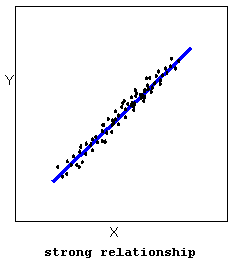
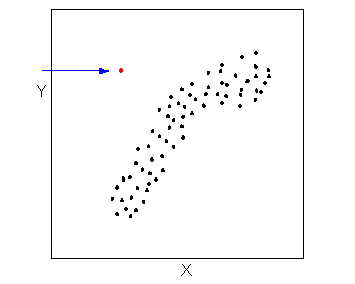
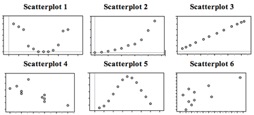
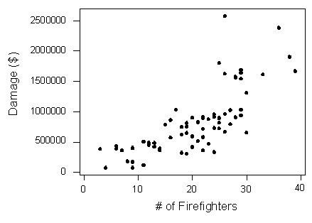

```{r, echo=FALSE, warning=FALSE}
knitr::opts_chunk$set(comment="#", fig.retina=2, crayon.enabled = TRUE)
library(stats)
library(kableExtra)
library(knitr)
library(formattable)
library(ggplot2)
library(ggthemes)
library(ggExtra)
library(dplyr,warn.conflicts = FALSE)
library(latex2exp)
```

## Learning Goals

- Summarize and interpret the relationship between two quantitative variables.

- Demonstrate understanding of concepts pertaining to linear regression.

- Use regression equations to make predictions and understand its limits.

---

## Scatterplots

- Correlation refers to a relationship between two quantitative variables:  
  
  - the independent (or explanatory) variable, usually denoted by $x$.
  
  - the dependent (or response) variable, usually denoted by $y$.

- **Example:** In a study of education attainment and annual salary, the years of education is the explanatory variable and the annual salary is the response variable.

- To describe the relationship between two quantitative variables, statisticians use a scatterplot.

- In a scatterplot, we describe the overall pattern with descriptions of direction, form, and strength.

---

## Direction of Linear Relationship

:::: {.row}
::: {.pull-left}
- **Positive relationship**: the response variable (y) increases when the explanatory variable (x) increases.

```{r grade, echo=FALSE, result='asis', message=FALSE, fig.align = 'center', fig.align = 'center', fig.width=6, fig.asp=1}
 load("Data-Frames-SUNY-Concepts-in-Statistics/gradebook.rdata")
 gradebook <- rename(data)
 ggplot(head(gradebook,20), aes(x=Midterm1, y=Final)) +
   geom_point(cex=3) +
   geom_smooth(method=lm, se=FALSE) +
   theme_bw()
```
:::

::: {.pull-right}
- **Negative relationship**: the response variable (y) decreases when the explanatory variable (x) increases.
  
```{r mtcar, echo=FALSE, result='asis', message=FALSE, fig.align = 'center', fig.width=6, fig.asp=1}
ggplot(head(mtcars,20), aes(x=wt, y=mpg)) +
  geom_point(cex=3) +
  geom_smooth(method=lm, se=FALSE) +
  theme_bw()
```  
:::
::::

---

## Forms of Scatterplots

:::: {.row}
::: {style="width: 33%;"}

```{r cellphone, echo=FALSE, result='asis', message=FALSE, fig.align = 'center', fig.width=6, fig.asp=1}
load("Data-Frames-SUNY-Concepts-in-Statistics/cell_phones.RData")
cellphone <- rename(data)
ggplot(na.omit(head(cellphone,20)), aes(x=Math, y=Verbal)) +
  geom_point(cex=3) +
  geom_smooth(method=lm, se=FALSE) +
  theme_bw() +
  ggtitle("Linear Form") +
  theme(plot.title = element_text(size = 30, face = "bold", hjust = 0.5))
```  
:::

::: {style="width: 33%;"}

```{r Anscombe, echo=FALSE, result='asis', message=FALSE, fig.align = 'center', fig.width=6, fig.asp=1}
Anscombe.II.x<- c(10.0, 8.0, 13.0, 9.0, 11.0, 14.0, 6.0, 4.0, 12.0, 7.0, 5.0)
Anscombe.II.y<- c(9.14, 8.14, 8.74, 8.77, 9.26, 8.10, 6.13, 3.10, 9.13, 7.26, 4.74)
Anscombe.data <- data.frame(Anscombe.II.x, Anscombe.II.y)
ggplot(Anscombe.data, aes(x=Anscombe.II.x, y=Anscombe.II.y)) +
  geom_point(cex=3) +
  geom_smooth(method=loess, se=FALSE) +
  theme_bw() +
  ggtitle("Curvilinear Form") +
  theme(plot.title = element_text(size = 30, face = "bold", hjust = 0.5))
```
:::

::: {style="width: 33%;"}

```{r datAB, echo=FALSE, result='asis', message=FALSE, fig.align = 'center', fig.width=6, fig.asp=1}
set.seed(955)
dat <- data.frame(cond = rep(c("A", "B"), each=10),
                  xvar = 1:10 + rnorm(20,sd=2),
                  yvar = 1:10 + rnorm(10,sd=5))
ggplot(dat, aes(x=xvar, y=yvar)) +
  geom_point(cex=3) +
  geom_smooth(method=lm, se=FALSE) +
  theme_bw()  +
  xlab("x") +
  ylab("y") +
  ggtitle("No obvious relationship") + 
  theme(plot.title = element_text(size = 30, face = "bold", hjust = 0.5))
```
:::
::::

---

## Strength of Relationship

The strength of the relationship is a description of how closely the data follow the form of the relationship.

::::: {.row}
:::: {.pull-left}
::: {.center}
{width="60%"}
:::
::::

:::: {.pull-right}
::: {.center}
{width="60%"}
:::
::::
:::::

---

## Outliers

- Outliers are points that deviate from the pattern of the relationship.

::: {.center}
{width="40%"}
:::

---

## Practice: Match Scatterplots {.unnumbered}

:::: {.row style="font-size: .9em; margin-top:-1em;"}

::: {.pull-left}

{width="80%"}

**A:** X = month (January = 1), Y = rainfall (inches) in Napa, CA in 2010 (Note: Napa has rain in the winter months and months with little to no rainfall in summer.)

**B:** X = month (January = 1), Y = average temperature in Boston MA in 2010 (Note: Boston has cold winters and hot summers.)

:::

::: {.pull-right}

**C:** X = year (in five-year increments from 1970), Y = Medicare costs (in $) (Note: the yearly increase in Medicare costs has gotten bigger and bigger over time.)

**D:** X = average temperature in Boston MA (°F), Y = average temperature in Boston MA (°C) each month in 2010

**E:** X = chest girth (cm), Y = shoulder girth (cm) for a sample of men

**F:** X = engine displacement (liters), Y = city miles per gallon for a sample of cars (Note: engine displacement is roughly a measure of engine size. Large engines use more gas.)

:::

::::

::: {.footmark}
Source: [Scatterplots 2 of 5 in Concepts of Statistics](https://courses.lumenlearning.com/wmopen-concepts-statistics/chapter/scatterplots-2-of-5/)
:::

---

## The Correlation Coefficient

The **correlation coefficient** $r$ is a numeric measure that measures the strength and direction of a linear relationship between two quantitative variables.
$$r=\dfrac{\sum\left(\frac{x-\bar{x}}{s_x}\right)\left(\frac{y-\bar{y}}{s_y}\right)}{\sqrt{\sum\left(\frac{x-\bar{x}}{s_x}\right)^2}\cdot\sqrt{\left(\frac{y-\bar{y}}{s_y}\right)^2}}=\dfrac{\sum\left(\frac{x-\bar{x}}{s_x}\right)\left(\frac{y-\bar{y}}{s_y}\right)}{n-1},$$
where $n$ is the sample size, $x$ is a data value for the explanatory variable, $\bar{x}$ is the mean of the $x$-values, $s_x$ is the standard deviation of the $x$-values, and similarly, for the notations involving $y$.

---

## A Few Remarks on Correlation Coefficient

- The expression $z=\frac{x-\bar{x}}{s_x}$ is known as the **standardized variable (or $z$-score)** which
  
  - doesn't depend on the unit of the variable $x$,
  
  - has mean $0$ and standard deviation 1.
  
- In Excel, the correlation coefficient can be calculated using the function `CORREL()`.

- [Scatterplots with different correlation coefficients](https://courses.lumenlearning.com/wmopen-concepts-statistics/chapter/linear-relationships-2-of-4/).

- **Rounding Rule:** Round to the nearest thousandth for $r$, $m$ and $b$.

---

## Geometric Intuition

:::: {.row}

::: {.pull-left}

```{r AnscombeLM, echo=FALSE, result='asis', message=FALSE, fig.align = 'center', fig.width=7.5, fig.asp=1}
Anscombe.I.x<- c(10.00,8.00,13.00,9.00,11.00,14.00,6.00,4.00,12.00,7.00,5.00)
Anscombe.I.y<- c(8.04, 6.95, 7.58, 8.81, 8.33, 9.96, 7.24, 4.26, 10.84, 4.82, 5.68)
Anscombe.data <- data.frame(Anscombe.I.x, Anscombe.I.y)
ggplot(Anscombe.data, aes(x=Anscombe.I.x, y=Anscombe.I.y)) +
  geom_point(cex=3) +
  geom_smooth(method=lm, se=FALSE) + 
  geom_vline(xintercept=mean(Anscombe.data$Anscombe.I.x))+
  geom_hline(yintercept=mean(Anscombe.data$Anscombe.I.y))+
  theme_bw() +
  xlab("x") +
  ylab("y") -> p1
r1 <- format(round(cor(Anscombe.data$Anscombe.I.x, Anscombe.data$Anscombe.I.y, method="pearson"), 3), nsmall=3)
text1 <- paste("$r=", r1, "$")
p1 +   ggtitle(TeX(text1)) + 
  theme(plot.title = element_text(size = 30, face = "bold", hjust = 0.5, vjust = 1))
```
:::

::: {.pull-right}

```{r datABLM, echo=FALSE, result='asis', message=FALSE, fig.align = 'center', fig.width=7.5, fig.asp=1}
set.seed(955)
dat <- data.frame(cond = rep(c("A", "B"), each=10),
                  xvar = 1:10 + rnorm(20,sd=2),
                  yvar = 1:10 + rnorm(10,sd=5))
p2 <- ggplot(dat, aes(x=xvar, y=yvar)) +
  geom_point(cex=3) +
  theme_bw()  +
  xlab("x") +
  ylab("y") + 
  geom_vline(xintercept=mean(dat$xvar))+
  geom_hline(yintercept=mean(dat$yvar))
r2 <- format(round(cor(dat$xvar, dat$yvar, method="pearson"), 3), nsmall=3)
text2 <- paste("$r = ", r2, "$")
p2  +  ggtitle(TeX(text2)) + 
  theme(plot.title = element_text(size = 30, face = "bold", hjust = 0.5, vjust = 1))
```
:::
::::

---

## Geometric Conclusion

For the scatterplots in the previous slides, we see that

- $r>0$ if all points $(x-\bar{x}, y-\bar{y})$ are in the 1st and the 3rd quadrants.

- $r<0$ if all points $(x-\bar{x}, y-\bar{y})$ are in the 2nd and the 4th quadrants.

- $r$ is bigger if points are closer to a line.

The idea of using product is from the geometric interpretation of $\mathbf{u}\cdot\mathbf{v}=\lVert \mathbf{u}\rVert\lVert\mathbf{v}\rVert\cos\theta$.

---

## Properties

- The correlation coefficient $r$ is between $-1$ and $1$.

- The closer the absolute value $|r|$ is to $1$, the stronger the linear relationship is.

- The correlation is symmetric in $x$ and $y$, that is `CORREL(x, y)=CORREL(y, x)`.

- The correlation does not change when the units of measurement of either one of the variables change. In other words, if we change the units of measurement of the explanatory variable and/or the response variable, it has no effect on the correlation  $r$.

::: {.remark}
The reason that $|r|$ is less than $1$ is from the [Cauchy-Schwarz inequality](https://en.wikipedia.org/wiki/Cauchy%E2%80%93Schwarz_inequality): $(\sum XY)^2\le \sum X^2\sum Y^2$.
:::

---

## Limitations and Sensitivity to Outliers

- The correlation by itself is not enough to determine whether a relationship is linear. It's important to graph data set before analyzing it. [See Francis Anscombe's demonstration both the importance of graphing data and the effect of outliers on statistical properties.](https://en.wikipedia.org/wiki/Anscombe%27s_quartet)

- The correlation is heavily influenced by outliers. [Try the simulation in Linear Relation (4 of 4) in Concepts in Statistics](https://courses.lumenlearning.com/wmopen-concepts-statistics/chapter/linear-relationships-4-of-4/)

---

## Practice: Guess the Correlation Coefficient {.unnumbered}

::: {.iframecontainer}
`r knitr::include_url("https://istats.shinyapps.io/guesscorr/", height="550px")`
:::

::: {.footmark}
Source: <https://istats.shinyapps.io/guesscorr/>
:::

---

## Example: The Correlation Coefficient (1 of 2)

:::: {.row style="font-size: 0.9em; margin-top=-2em;"}

::: {style="width: 68%;"}
Describe the relationship between Midterm 1 and Final for a sample of 10 students with data shown on the right.

**Solution:** First we create a scatterplot.

```{r echo=FALSE, result='asis', message=FALSE, fig.align = 'center', fig.width=4, fig.asp=1}
ggplot(gradebook[20:30,c("Midterm1", "Final")], aes(x=Midterm1, y=Final)) +
  geom_point(cex=3) +
  geom_smooth(method=lm, se=FALSE) +
  theme_bw()
```

Using the Excel function `CORREL(x, y)`, we find the correlation coefficient is
$r=`r format(round(cor(gradebook[20:30,c("Midterm1", "Final")]$Midterm1, gradebook[20:30,c("Midterm1", "Final")]$Final, method="pearson"), 3), nsmall=3)`$ .

The $r$-value shows a **strong positive linear** relationship.

:::

::: {style="width: 30%; margin-top=-1em;"}
```{r echo=FALSE, result='asis'}
kable(gradebook[20:30,c("Midterm1", "Final")],
    format = "html",
    booktabs = TRUE,
    align = "c",
   row.names = FALSE
  ) %>%
  kable_styling(bootstrap_options = c("striped", "hover", "condensed"), font_size = 24) %>%
  column_spec(1:2, width = "7em")
```
:::
::::

---

## Example: The Correlation Coefficient (2 of 2)

:::: {.row}
::: {style="width: 38%;"}

The correlation coefficient $r$ can also be calculation by hand using the formula.
$\dfrac{\sum z_xz_y}{n-1}$, where $z_x=\frac{x-\bar{x}}{s_x}$ and $z_y=\frac{y-\bar{y}}{s_y}$.
:::

::: {style="width:60%; font-size:0.7em;"}
| Midterm1 | Final    | z_x      | z_y      | z_xy        |
| -------- | -------- | -------- | -------- | ----------- |
| 72       | 72       | -0.78006 | -1.06926 | 0.834087814 |
| 93       | 88       | 1.50088  | 1.544483 | 2.318083715 |
| 81       | 82       | 0.197484 | 0.56433  | 0.111446332 |
| 82       | 82       | 0.306101 | 0.56433  | 0.172741815 |
| 94       | 88       | 1.609497 | 1.544483 | 2.485839773 |
| 80       | 77       | 0.088868 | -0.25246 | -0.02243591 |
| 73       | 78       | -0.67145 | -0.0891  | 0.059829084 |
| 71       | 77       | -0.88868 | -0.25246 | 0.224359064 |
| 81       | 76       | 0.197484 | -0.41582 | -0.08211835 |
| 81       | 76       | 0.197484 | -0.41582 | -0.08211835 |
| 63       | 68       | -1.75761 | -1.72269 | 3.027820885 |
| 79.18182 | 78.54545 |<- mean   | sum ->   | 9.047535876 |
| 9.206717 | 6.121497 |<- stdev.s|correl -> | 0.904753588 |
:::
::::

---

## Practice: Calculate Correlation Coefficient {.unnumbered}

::: {.iframecontainer}
`r knitr::include_url('https://www.myopenmath.com/embedq2.php?id=1716&seed=2020&showansafter')`
:::

---

## Correlation vs Causation

- Correlation is described by data from observational study. Observational studies cannot prove cause and effect which requires controlled study and rigorous inferences.

- Correlation may be used to make a prediction which is probabilistic.

- In a linear relationship, an $r$-value that is close to 1 or -1 is insufficient to claim that the explanatory variable causes changes in the response variable. The correct interpretation is that there is a statistical relationship between the variables.

- A **lurking variable** is a variable that is not measured in the study, but affects the interpretation of the relationship between the explanatory and response variables.

---

## Example: Correlation vs Causation (1 of 2)

The scatterplot below shows the relationship between the number of firefighters sent to fires (x) and the amount of damage caused by fires (y) in a certain city.


Can we conclude that the increase in firefighters causes the increase in damage?

::: {.footmark}
Source: [Causation and Lurking Variables in Concepts in Statistics for more example](https://courses.lumenlearning.com/wmopen-concepts-statistics/chapter/linear-relationships-4-of-4/)
:::

---

## Example: Correlation vs Causation (2 of 2)

**Solution:**

1. Correlation: The more fire fighters, the more likely there is bigger damage. However the fire fighters do not cause the fire.
  
2. Prediction: You could predict the amount of damage by looking at the number of fire fighters present.
  
3. Causation: The fire fighters are unlikely the cause of the fire.
  
4. Lurking variable: The seriousness of the fire is a lurking variable.

---

## Practice: Lurking Variable {.unnumbered}

::: {.iframecontainer}
`r knitr::include_url('https://www.myopenmath.com/embedq2.php?id=584887&seed=2020&showansafter')`
:::

---

## The Regression Line

- The line that best summarizes a linear relationship is **the least squares regression line**, that is, the line with the smallest sum of squares of the errors (**SSE**).

- For a value of the explanatory variable $x$, the corresponding $y$-values, denoted as $\hat{y}$, on the least-squares regression line can be used to predict the real $y$-value.

- The regression line is unique and passes though $(\bar{x}, \bar{y})$. An equation is given by
  $$\hat{y}=m(x-\bar{x})+\bar{y}=m x+b,$$
  where the slope is $$m=\frac{\sum(x-\bar{x})(y-\bar{y})}{\sum(x-\bar{x})^2}=r\frac{s_y}{s_x}$$ and the $y$-intercept is
  $b=\bar{y}-m\bar{x}.$

---

## Predication Error

- The **error of a prediction** is
  $$\text{Error}=\text{Observed}-\text{Predicted}=y-\hat{y}.$$

- A prediction beyond the range of the data is called **extrapolation**.

---

## Example: Old Faithful Geyser (1 of 2)

The following sample is taken from data about the Old Faithful geyser.

1. Study the linear relationship.
2. Find the regression line, and the predicated value and the error if the eruption time is 1.8 minutes.

::::: {.row}
:::: {.pull-left}
::: {.center}
```{r echo=FALSE, result='asis'}
spring1 <- faithful[12:16, c("eruptions", "waiting")]
spring2 <- faithful[17:21, c("eruptions", "waiting")]
kable(cbind(spring1,spring2),
    format = "html", 
    booktabs = TRUE, 
    align = "c",
   row.names = FALSE
  ) %>%
  kable_styling(full_width = F, bootstrap_options = c("striped", "hover", "condensed")) %>%
  column_spec(1:4, width="6em")
```
:::
::::

::: {.pull-right}
```{r echo=FALSE, result='asis', message=FALSE, fig.align = 'center', fig.width=5, fig.asp=1}
spring <- faithful[12:21, c("eruptions", "waiting")]
ggplot(spring, aes(y=waiting, x=eruptions)) +
  geom_point(cex=3) +
  geom_smooth(method=lm, se=FALSE) +
  theme_bw()
```
:::
:::::

---

## Example: Old Faithful Geyser (2 of 2)

**Solution:** The Scatterplot shows a linear relationship.

`r reg.line=lm(spring$waiting ~ spring$eruptions)`

The slope of the regression line can be obtained using the Excel function `SLOPE()`. In this example, $m= `r coefx=round(reg.line$coefficients[2],3)` `r coefx`$.
  
The $y$-intercept $(0,b)$ can be obtained using the Excel function `INTERCEPT()`. In this example, $b= `r yint=round(reg.line$coefficients[1],3)` `r yint`$.
  
An equation of the line is then $\hat{y}=`r coefx`x + `r yint`$.

When $x=1.8$, we have $\hat{y}=`r coefx`*1.8 + `r yint`=`r ypred=coefx*1.8+yint` `r ypred`$.

The error is $y-\hat{y}=`r spring[10, ]$waiting`-`r ypred`=`r error=spring[10,]$waiting-ypred` `r error`$. That means the predication over-estimates the eruption time about `r round(error, 2)` minutes.

---

## Practice: Find Regression Line {.unnumbered}

::: {.iframecontainer}
`r knitr::include_url('https://www.myopenmath.com/embedq2.php?id=902994&seed=2020&showansafter')`
:::

---

## Residuals

- The prediction error is also called a **residual**. Another way to express the previous equation is $y=\hat{y}+\text{residual}$.
- **Residual plots** are used to determine if a linear model is appropriate.
- A random pattern (or no obvious pattern) indicates a good fit of a linear model.  [See Assessing the Fit of a Line (2 of 4) in Concepts in Statistics for examples.](https://courses.lumenlearning.com/wmopen-concepts-statistics/chapter/assessing-the-fit-of-a-line-2-of-4/)
- Another measure of the fit of the regression is the **residual standard errors** (or **standard error of the regression**), calculated by the Excel function `STEYX()`,  is $s_e=\sqrt{\dfrac{SSE}{n-2}}$, where $SSE=\sum (y-\hat{y})^2$ is the sum of square errors.
- The smaller $s_e$ is, the more accurate the prediction is.

---

## Coefficient of Determination

One measure of the fit of a regression line is the proportion of the variation in the response variable that is explained by the least-squares regression line.
  
- The **total variance** is $SSD=\sum(y-\bar{y})^2$

- The **explained variance** is $SSR=\sum(\hat{y}-\bar{y})^2$.

- The **coefficient of determination** is $r^2=\dfrac{SSR}{SSD}=\dfrac{\sum(y-\bar{y})^2}{\sum(\hat{y}-\bar{y})^2}$.

---

## Remarks on Coefficient of Determination

- The $r$ in the coefficient of determination is the correlation coefficient. Equivalently, $r=\pm\sqrt{r^2}$.

- The smaller the standard error, the larger the coefficient of determination: $r^2=1-\dfrac{SSE}{SSD}=1-\dfrac{(n-2)s_e^2}{SSD}$.

- $n−2$ is the degrees of freedom. We lose two degrees of freedom because we estimate the slope and the $y$-intercept.

- In a linear regression model $Y=\beta_0 + \beta_1 X +\epsilon$, even we have $\beta_0$ and $\beta_1$ from the population, we still need to estimate the standard deviation of error.

---

## Example: $s_e$ and $r^2$

::::: {.row}
::: {style="63%;"}
Find the standard error and coefficient of determination for the data of midterm1 and final.

**Solution:**
```{r include=FALSE}
cor_GradeBook=round(cor(GradeBook$Midterm1, GradeBook$Final),digits=3)
model=lm(formula = Final ~ ., data=GradeBook)
```

In Excel, the function `STEXY()` can be used to obtain the residual standard error. In this example, $s_e\approx `r round(sqrt(deviance(model)/df.residual(model)),3)`$.

The correlation coefficient is $`r cor_GradeBook`$.

The coefficient determination is $r^2=`r cor_GradeBook`^2\approx `r round(cor_GradeBook^2,3)`$.
:::

:::: {style="35%;"}
::: {.center}
```{r echo=FALSE, result='asis'}
load("Data-Frames-SUNY-Concepts-in-Statistics/gradebook.rdata")
gradebook <- rename(data)
GradeBook <- gradebook[20:30,c("Midterm1", "Final")]
kable(GradeBook,
    format = "html",
    booktabs = TRUE,
    align = "c",
   row.names = FALSE
  ) %>%
  kable_styling(full_width = F, bootstrap_options = c("striped", "hover", "condensed"), font = 24) %>%
  column_spec(1:2, width="8em")
```
:::
::::
:::::

---

## Practice: Analyzing Linear Relationship {.unnumbered}

::: {.iframecontainer}
`r knitr::include_url('https://www.myopenmath.com/embedq2.php?id=905035&seed=2020&showansafter')`
:::

---

<!--# class="middle center" -->

::: {.part}
Lab Instruction in Excel
:::

---

## Scatter Plots and Correlation Coefficient

- To create a scatter plot, first select the data sets, and then look for `Insert Scatter(X, Y)` in the menu `Insert`-> `Charts`.

- The correlation coefficient $r$ can be calculated by the Excel function `correl()`.

---

## Slope, Intercept, Coefficient of Determination and Standard Error

- The slope of a linear regression can be calculated by the Excel function `SLOPE()`.

- The $y$-intercept of a linear regression can be calculated by the Excel function `INTERCEPT()`.

- The coefficient of determination can be calculated by first finding $r$, then applying the formula `r^2`.

- The standard error of the regression (residual standard error) can be calculated by the Excel function `STEYX()`.
